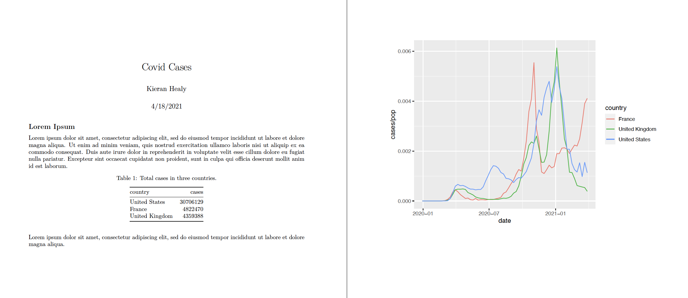
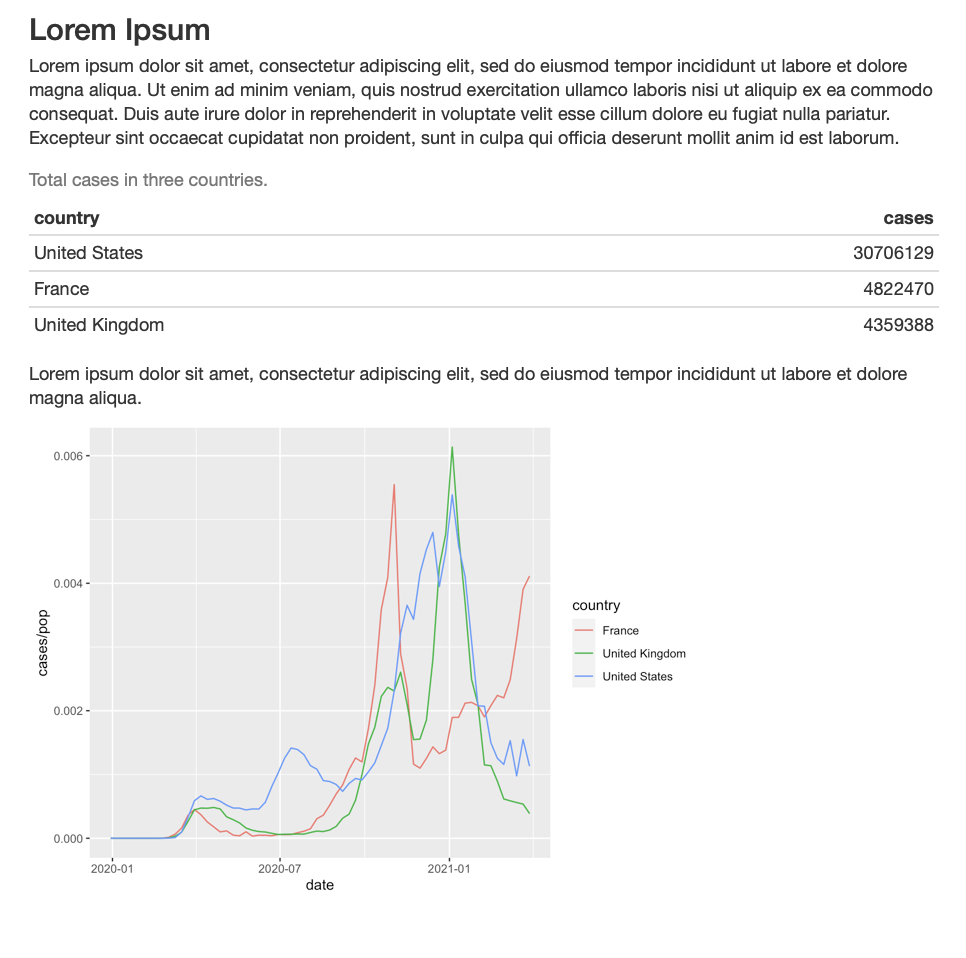
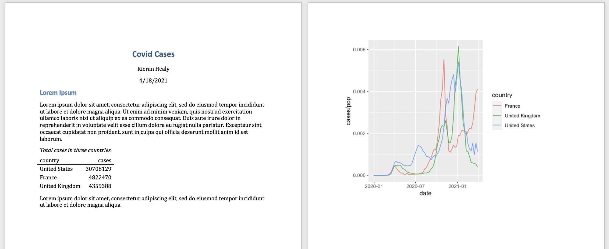
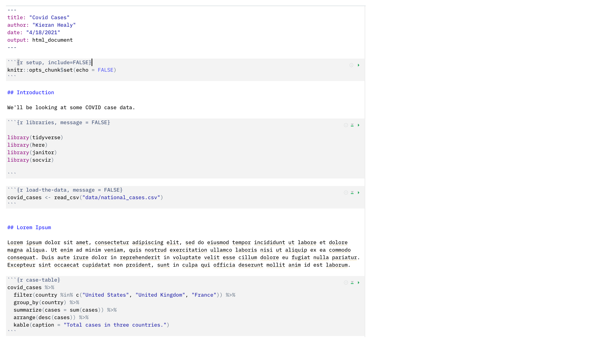
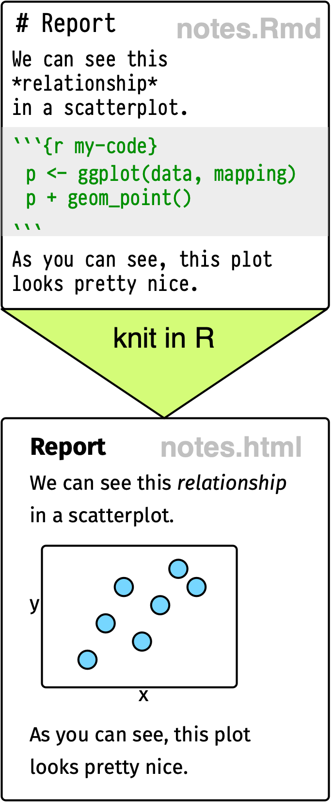
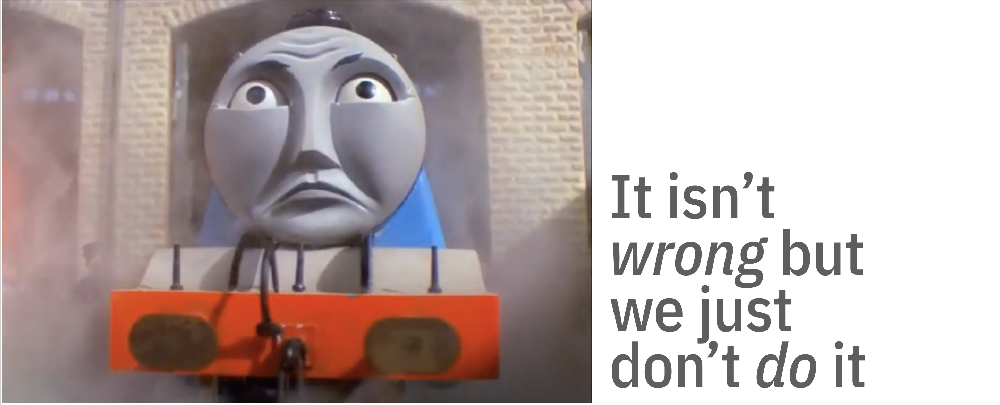
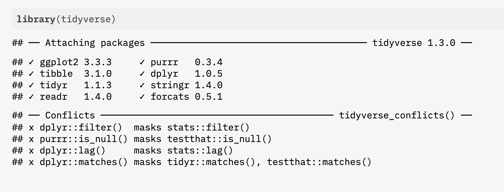
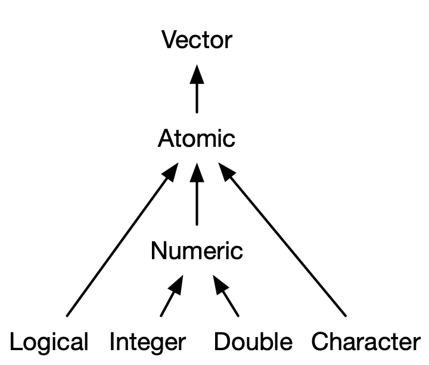
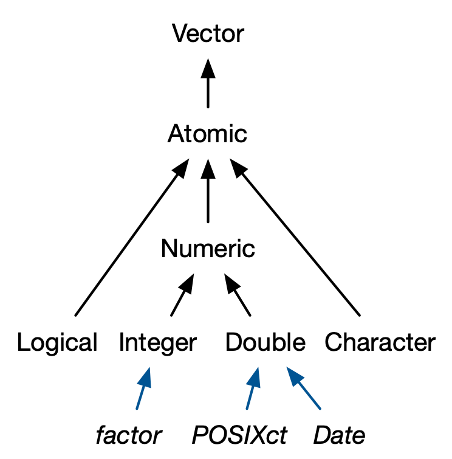
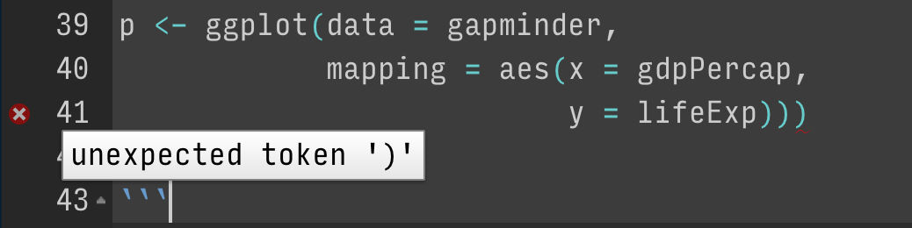

```{r packages, include=FALSE}
library(flipbookr)
library(here)
library(tidyverse)
library(kjhslides)
```


```{r setup, include=FALSE}

kjh_register_tenso()

kjh_set_knitr_opts()

kjh_set_slide_theme()

kjh_set_xaringnan_opts()

```

class: center middle main-title section-title-1

# Finding your way in .kjh-yellow[R]

.class-info[

**Data Visualization: Session 2**

.light[Kieran Healy<br>
Statistical Horizons, September 2021]

]

---

layout: false
class: center

# .middle.huge.squish4[Using RMarkdown to .kjh-orange[produce] and .kjh-green[reproduce] your work]

---

layout: true
class: title title-1

---

# Where we want to end up

.center[]  

---

# Where we want to end up

.center[]  

---

# Where we want to end up

.center[]  

---

# How to get there?

.pull-left[] 

.pull-right[

- Write an R script with some notes inside. Create some figures and tables, paste them into our document.

- This will work, but we can do better.

]

---

# We can make this ...


.center[]  

---

# ... by writing this

.center[]  

---

# The code gets replaced by its output


.pull-left[]

.pull-right[]

---

layout: false
class: center



---

.center[]  

---

.pull-left[]  


--

.right[

- This approach has its limitations, but it's _very_ useful.

]
---

.pull-left[]  


.pull-right[- When learning these workflows, stick with the defaults at the beginning. Later, you can customize the look of the output in all kinds of ways.]


---

layout: true
class: title title-1

---

# The right frame of mind

- This is like learning how to drive a car, or how to cook in a kitchen ... or learning to speak a language.

--

- After some orientation to what's where, you will learn best by _doing_.

--

- Software is a pain, but you won't crash the car or burn your house down. 

???

- Don't be afraid of the IDE or code. Expect to be frustrated, and don't be surprised when things go wrong. Things will go wrong _constantly_. The software is a very powerful, very obedient, and _very_ dumb robot.

- But every time things "don't work", and every time you diagnose and fix them, you will become a little more adept at noticing and fixing these errors. And you will start to accumulate practical knowledge of common failures.

- So be like Jacques and keep at it.

---

layout: false
class: center

## .top.huge.squish4[TYPE OUT<br />YOUR CODE<br />.kjh-orange[BY HAND]]

--

- .w50.SMALL[_By far_ the best way to get a feel for how R works, and to get comfortable with the cycle of try-fail-cry fix-fail-retry that is a permanent part of writing any code.]


---

.center[]

---

layout: false
class: center

# .huge.middle.squish4[<br />GETTING <br />O.kjh-orange[R]IENTED]

---

layout: true
class: title title-1

---

# Loading the tidyverse libraries

```{r loadtv, message = TRUE}
library(tidyverse)
```

The tidyverse has several components. 

We'll return to this message about Conflicts later.

---

# Tidyverse components

.pull-left[

- .kjh-green[**`library`**]`(tidyverse)`
- `Loading tidyverse: ggplot2`
- `Loading tidyverse: tibble`
- `Loading tidyverse: tidyr`
- `Loading tidyverse: readr`
- `Loading tidyverse: purrr`
- `Loading tidyverse: dplyr`
]

--

.pull-right[
- Call the package and ...
- `<|` **Draw graphs**
- `<|` **Nicer data tables**
- `<|` **Tidy your data**
- `<|` **Get data into R**
- `<|` **Fancy Iteration**
- `<|` **Action verbs for tables**

]

---

# What R looks like


Code you can type and run:

```{r 02-about-r-1}
## Inside code chunks, lines beginning with a # character are comments
## Comments are ignored by R

my_numbers <- c(1, 1, 2, 4, 1, 3, 1, 5) # Anything after a # character is ignored as well

```

Output:

.smaller[Equivalent to running the code above, typing `my_numbers` at the console, and hitting enter.]

```{r 02-about-r-2}
my_numbers 
```

---

# What R looks like

By convention, code output in documents is prefixed by `##`

```{r 02-about-r-3}
my_numbers 
```


--

.small[Also by convention, outputting vectors, etc, gets a counter keeping track of the number of elements. For example,] 

```{r 02-about-r-4}
letters
```


---

layout: false
class: center

# .center.middle.huge.squish4[SOME THINGS<br />TO KNOW<br />ABOUT .kjh-orange[R]] 

---

layout: true
class: title title-1

---

# 0. .kjh-yellow[It's a calculator]

.pull-left[

- Arithmetic


```{r 02-about-r-5}
(31 * 12) / 2^4
```

```{r 02-about-r-6}
sqrt(25)
```

```{r 02-about-r-7}
log(100)

log10(100)

```

]

--

.pull-right[

- Logic

```{r 02-about-r-8}
4 < 10
4 > 2 & 1 > 0.5 # The "&" means "and"
4 < 2 | 1 > 0.5 # The "|" means "or"
4 < 2 | 1 < 0.5
```
]

---

# Boolean and Logical operators

Logical equality and inequality (yielding a .kjh-green[`TRUE`] or .kjh-red[`FALSE`] result) is done with `==` and `!=`. Other logical operators include `<`, `>`, `<=`, `>=`, and `!` for negation.

.medium[

```{r 02-about-r-9}
## A logical test
2 == 2 # Write `=` twice
```

```{r 02-about-r-10, eval = FALSE}
## This will cause an error, because R will think you are trying to assign a value
2 = 2

## Error in 2 = 2 : invalid (do_set) left-hand side to assignment
```

```{r 02-about-r-11}
3 != 7 # Write `!` and then `=` to make `!=`
```
]
---
# .kjh-red[Watch out!]

Here's a gotcha. You might think you could write `3 < 5 & 7` and have it be interpreted as "Three is less than five and also less than seven [True or False?]":

```{r 02-about-r-12}
3 < 5 & 7
```

--

It seems to work!

---

# .kjh-red[Watch out!]

But now try `3 < 5 & 1`, where your intention is "Three is less than five and also less than one [True or False?]"

.pull-left[

```{r 02-about-r-13}
3 < 5 & 1
```

.smaller.squish1[What's happening is that `3 < 5` is evaluated first, and resolves to .kjh-green[TRUE], leaving us with the expression .kjh-green[`TRUE`] `& 1`. R interprets this as .kjh-green[`TRUE`] `& as.logical(1)`. In Boolean algebra, `1` resolves to  .kjh-green[`TRUE`]. Any other number is .kjh-red[`FALSE`]. So,]

```{r 02-about-r-14}
TRUE & as.logical(1)
```

]

--

.pull-right[

```{r 02-about-r-15}
3 < 5 & 3 < 1
```

- .smaller[You have to make your comparisons explicit.]


]

---

# Logic and floating point arithmetic

Let's evaluate `0.6 + 0.2 == 0.8`

--

```{r 02-about-r-16}
0.6 + 0.2 == 0.8
```

--

Now let's try `0.6 + 0.3 == 0.9`

--

```{r 02-about-r-17}
0.6 + 0.3 == 0.9
```

--

Er. That's not right.

--

Welcome to floating point math!

---

# Logic and floating point arithmetic

.small[In Base 10, you can't precisely express fractions like] $\frac{1}{3}$ and $\frac{1}{9}$. .small[They come out as repeating decimals: 0.3333... or 0.1111... You _can_ cleanly represent fractions that use a prime factor of the base, which in the case of Base 10 are 2 and 5.] 

--

.small[Computers represent numbers as binary (i.e. Base 2) floating-points. In Base 2, the only prime factor is 2. So] $\frac{1}{5}$ or $\frac{1}{10}$ .small[in binary would be repeating.] 

---

# Logic and floating point arithmetic

When you do binary math on repeating numbers and convert back to decimals you get tiny leftovers, and this can mess up _logical_ comparisons of equality. The .kjh-green[**`all.equal()`**] function exists for this purpose.

--

```{r 02-about-r-18}
print(.1 + .2)
print(.1 + .2, digits=18)

all.equal(.1 + .2, 0.3)
```

--

See e.g. [https://0.30000000000000004.com](https://0.30000000000000004.com) 

---

layout: false
class: center

# .huge.middle.squish4[More later on why this might bite you, and how to deal with it]

--

- .smaller[For now, "Be very careful about doing logical comparisons on floating-point numbers" is not a bad rule.]

---

layout: true
class: title title-1

---

# 1. .kjh-yellow[Everything in R has a name]

```{r 02-about-r-19}
my_numbers # We created this a few minutes ago

letters  # This one is built-in

pi  # Also built-in
```

---

# Some names are forbidden

Or it's a _really_ bad idea to try to use them 

```{r 02-about-r-20, eval = FALSE}
TRUE
FALSE
Inf
NaN 
NA 
NULL

for
if
while
break
function
```

---

# 2. .kjh-yellow[Everything is an object]

There are a few built-in objects:


```{r 02-about-r-21}
letters
```

--

```{r 02-about-r-22}
pi
```

--

```{r 02-about-r-23}

LETTERS
```

---

# 3. .kjh-yellow[You can create objects] 

--

In fact, this is mostly what we will be doing.

--

Objects are created by .kjh-pink[_assigning_] a thing to a name:

```{r 02-about-r-24}
## name... gets ... this stuff
my_numbers <- c(1, 2, 3, 1, 3, 5, 25, 10)

## name ... gets ... the output of the function `c()`
your_numbers <- c(5, 31, 71, 1, 3, 21, 6, 52)
```

--

The .kjh-green[**`c()`**] function _combines_ or _concatenates_ things

???

The core thing we do in R is _create objects_ by _assigning a thing to a name_. That thing is usually the output of some _function_. There are a lot of built-in functions.

We can create an object with the .kjh-green[**`c()`**] function and the *assignment operator*, `<-`. 


---

# The assignment operator

- The .kjh-pink[assignment operator] performs the action of creating objects:

--

- Use a keyboard shortcut to write it:

- Press .kjh-green[**`option`**] _and_ .kjh-green[**`-`**] on a Mac

- Press .kjh-green[**`alt`**] _and_ .kjh-green[**`-`**] on Windows


---

# Assignment with .kjh-green[**`=`**]

- You can use ".kjh-green[**`=`**]" as well as ".kjh-green[**`<-`**]" for assignment

```{r 02-about-r-25}
my_numbers = c(1, 2, 3, 1, 3, 5, 25)

my_numbers
```


--

On the other hand, ".kjh-green[**`=`**]" has a different meaning when used in functions.

--

I'm going to use ".kjh-green[**`<-`**]" for assigment throughout. Just be consistent either way.

---

# Assignment with .kjh-green[**`=`**]

.center[]

???

--- 

layout: true
class: title title-1

---

# 4. .kjh-yellow[Do things to objects with functions]


```{r create_objects_again}

## this object... gets ... the output of this function
my_numbers <- c(1, 2, 3, 1, 3, 5, 25, 10)

your_numbers <- c(5, 31, 71, 1, 3, 21, 6, 52)
```

```{r 02-get-started-3}
my_numbers
```

- Functions can be identified by the parentheses after their names.

```{r 02-get-started-4}
my_numbers 
```


```{r this_will_error, eval = FALSE}
## If you run this you'll get an error
mean()
```

---

# What functions usually do

- They take .kjh-orange[**inputs**] to .kjh-pink[**arguments**]

- They perform .kjh-green[**actions**]

- They produce, or return, .kjh-lblue[**outputs**]

--

.pull-left[

## .kjh-lblue[`x`] .kjh-green[`<-`] .kjh-green[`c(`].kjh-orange[1, 2, 3, 1, 3, 5, 25, 10].kjh-green[`)`]

## .kjh-blue[`x`]

## .kjh-blue[`[1]  1  2  3  1  3  5 25 10`]

]
--

.pull-right[

## .kjh-green[**`mean`(**].kjh-pink[`x`] `=` .kjh-orange[`my_numbers`].kjh-green[**)**]

## .kjh-lblue[`[1] 6.25`]

]

---

# What functions usually do

.large[
```{r 02-about-r-26}
## Get the mean of what? Of x.
## You need to tell the function what x is
mean(x = my_numbers)

mean(x = your_numbers)
```
]

--- 

# What functions usually do

If you don't _name_ the arguments, R assumes you are providing them in the order the function expects.

```{r 02-about-r-27}
mean(your_numbers)
```

---

# What functions usually do

What arguments? Which order? Read the function's help page

```{r 02-about-r-28, eval=FALSE}
help(mean)
```

```{r 02-about-r-29, eval = FALSE}
## quicker
?mean
```

--

How to read an R help page ... 

---

# What functions usually do


Arguments often tell the function what to do in specific circumstances

```{r 02-about-r-30}
missing_numbers <- c(1:10, NA, 20, 32, 50, 104, 32, 147, 99, NA, 45)

mean(missing_numbers)

mean(missing_numbers, na.rm = TRUE)
```

--

Or select from one of several options

```{r 02-about-r-31}
## Look at ?mean to see what `trim` does
mean(missing_numbers, na.rm = TRUE, trim = 0.1)
```


---

# What functions usually do


.pull-left.w80[
There are all kinds of functions. They return different things.

```{r 02-about-r-32}
summary(my_numbers)
```

]
--

.pull-left.w80[You can assign the output of a function to a name, which turns it into an object. (Otherwise it'll send its output to the console.)

```{r 02-about-r-33}
my_summary <- summary(my_numbers)

my_summary
```

]
---

# What functions usually do

.pull-left.w80[Objects hang around in your work environment until they are overwritten by you, or are deleted.

```{r 02-about-r-34, eval = FALSE}
## rm() function removes objects
rm(my_summary)

my_summary

## Error: object 'my_summary' not found
```

]
---

# Functions can be .kjh-yellow[nested]

.pull-left.w80[
```{r 02-about-r-35}
c(1:20)
```
]

--

.pull-left.w80[
```{r 02-about-r-36}
mean(c(1:20))
```
]
--

.pull-left.w80[
```{r 02-about-r-37}
summary(mean(c(1:20)))
```
]

.pull-left.w80[
```{r 02-about-r-38}
names(summary(mean(c(1:20))))
```
]
--


.pull-left.w80[
```{r 02-about-r-39}
length(names(summary(mean(c(1:20)))))
```
]

--

.pull-left.w80[Nested functions are evaluated from the inside out.]

---

# Use the pipe operator: .kjh-pink[**`%>%`**]

Instead of nesting functions in parentheses, we can use the .kjh-pink[_pipe operator_]:


```{r 02-about-r-40}
c(1:20) %>% mean() %>% summary() %>% names() %>%  length()
```

--

Read this operator as "_.kjh-pink[**and then**]_"

--

Better, vertical space is free in R:


```{r 02-about-r-41}
c(1:20) %>% 
  mean() %>% 
  summary() %>% 
  names() %>% 
  length()
```

---

# Pipelines make code more .kjh-green[readable]

Not great, Bob:

```r
  serve(stir(pour_in_pan(whisk(crack_eggs(get_from_fridge(eggs), into = "bowl"), len = 40), temp = "med-high")))
```

--

Notice how the first thing you read is the last operation performed.

--

Really not much better:

.medium[
```r
serve(
  stir(
    pour_in_pan(
      whisk(
        crack_eggs(
          get_from_fridge(eggs), 
        into = "bowl"), 
      len = 40), 
    temp = "med-high")
  )
)
```
]
---

# Pipelines make code more .kjh-green[readable]

Much nicer:

.medium[
```r
eggs %>% 
  get_from_fridge() %>% 
  crack_eggs(into = "bowl") %>% 
  whisk(len = 40) %>% 
  pour_in_pan(temp = "med-high") %>% 
  stir() %>% 
  serve()

```
]
--

.pull-left.w60[We'll still use nested parentheses quite a bit, often in the context of a function working inside a pipeline. But it's good not to have too many levels of nesting.]

---


# Now showing at an R near you: .kjh-pink[`|>`]

- The pipe operator .kjh-pink[**`%>%`**] is not part of Base R. It was introduced in a package called `magrittr`. 

--

- It's been so successful, a version of it has been incorporated into Base R.

--

- It is denoted by .kjh-pink[**`|>`**]. Type .kjh-green[`|`] and then .kjh-green[`>`] to write it. It mostly but does not _quite_ replace .kjh-pink[**`%>%`**] in every case.\* 


- The magrittr pipe will continue to work as shown in these slides.

.footnote.tiny[.kjh-darkgrey[\*With the new pipe, you can only pass an object to the _first_ argument in a function. This is fine for most tidyverse pipelines, where the first argument is usually (implicitly) the data. But it does mean that most Base R functions will continue not to be easily piped, as most of them do not follow the convention of passing the current data as the first argument]]

---

# Functions are bundled into .kjh-yellow[packages]

--

Packages are loaded into your working environment using the .kjh-green[**`library()`**] function.

--

```{r 02-about-r-42}
## A package containing a dataset rather than functions
library(gapminder)

gapminder
```

---

# Functions are bundled into .kjh-yellow[packages]

--

.SMALL.squish2[You need only _install_ a package once (and occasionally update it). But you must _load_ the package in each R session before you can access its contents.]

.SMALL[

```{r 02-about-r-43, eval = FALSE}
## Do at least once for each package. Once done, not needed each time.
install.packages("palmerpenguins", repos = "http://cran.rstudio.com")

## Needed sometimes, especially after an R major version upgrade.
update.packages(repos = "http://cran.rstudio.com")

```


]

.SMALL[
```{r 02-about-r-44}
## To load a package, usually at the start of your RMarkdown document or script file
library(palmerpenguins)
penguins
```
]
---

# Grabbing a single function with .kjh-green[**`::`**]

.pull-left.w70["Reach in" to an unloaded package and grab a function directly, using .kjh-green[`<package>::<function>`]]

--

.pull-left.w70[
```{r 02-about-r-45, message = FALSE, echo = FALSE}
gtsummary::theme_gtsummary_journal(journal = "jama")
#gtsummary::theme_gtsummary_compact()
```

.less-medium[
```{r 02-about-r-46}
## A little glimpse of what we'll do soon
penguins %>% 
  select(species, body_mass_g, sex) %>% 
  gtsummary::tbl_summary(by = species) #<<
```
]
]
---

# Remember this warning about conflicts?



Notice how some functions in different packages have the same names.

--

Related concepts of _namespaces_ and _environments_.

---

# Scope of names
 
.small[
```{r 02-about-r-47}
x <- c(1:10)
y <- c(90:100)

x

y
```
]
--

.small[
```r
mean()

## Error in mean.default() : argument "x" is missing, with no default
```
]
--
.small[
```{r 02-about-r-48}
mean(x) # argument names are internal to functions

mean(x = x)

mean(x = y)

x

y

```
]

---

# 5. Objects come in .kjh-yellow[types] and .kjh-yellow[classes]

I'm going to speak somewhat loosely here for now, and gloss over some distinctions between object classes and data structures, as well as kinds of objects and their attributes.

--

The object inspector in RStudio is your friend.

--

You can ask an object what it is. 

```{r 02-about-r-49}
class(my_numbers)
typeof(my_numbers)
```


---

# 5. Objects come in .kjh-yellow[types] and .kjh-yellow[classes]

Objects can have more than one (nested) class:

--

```{r 02-about-r-50}
summary(my_numbers)

my_smry <- summary(my_numbers) # remember, outputs can be assigned to a name, creating an object

class(summary(my_numbers)) # functions can be nested, and are evaluated from the inside out

class(my_smry) # equivalent to the previous line
```

---

# 5. Objects come in .kjh-yellow[types] and .kjh-yellow[classes]


```{r 02-about-r-51}
typeof(my_smry)
attributes(my_smry)

## In this case, the functions extract the corresponding attribute
class(my_smry)
names(my_smry)
```

---

# The most common types of .kjh-green[vector]

.pull-left.small.kjh-darkgrey[

[]  

- From Hadley Wickham, _Advanced R_

]

--

.pull-right[

```{r 02-about-r-52}
my_int <- c(1, 3, 5, 6, 10)
is.integer(my_int)
is.double(my_int)

my_int <- as.integer(my_int)
is.integer(my_int)

my_chr <- c("Mary", "had", "a", "little", "lamb")
is.character(my_chr)

my_lgl <- c(TRUE, FALSE, TRUE)
is.logical(my_lgl)

```

]

---

# The most common types of .kjh-green[vector]

.pull-left.tiny.kjh-darkgrey[

[]  

- From Hadley Wickham, _Advanced R_

]

--

.pull-right.small[

```{r 02-about-r-53}
## Factors are for storing undordered or ordered categorical variables
x <- factor(c("Yes", "No", "No", "Maybe", "Yes", "Yes", "Yes", "No"))
x

summary(x) # Alphabetical order by default

typeof(x)       # Underneath, a factor is a type of integer ...
attributes(x)   # ... with labels for its numbers, or "levels" 
class(x)
levels(x)
is.ordered(x)

```

]

???

HW: 

Categorical data, where values come from a fixed set of levels recorded in factor vectors.

Dates (with day resolution), which are recorded in Date vectors.

Date-times (with second or sub-second resolution), which are stored in POSIXct vectors.

Durations, which are stored in difftime vectors.

---


# Vector types can't be heterogenous 

Objects can be manually or automatically coerced from one class to another. Take care!

--

```{r 02-get-started-9}
class(my_numbers)

my_new_vector <- c(my_numbers, "Apple")

my_new_vector # vectors are homogeneous/atomic

class(my_new_vector)
```

--

```{r 02-about-r-54}
my_dbl <- c(2.1, 4.77, 30.111, 3.14519)
is.double(my_dbl)

my_dbl <- as.integer(my_dbl)

my_dbl

```


---

# A table of data is a kind of .kjh-yellow[list]

.SMALL[
```{r 02-about-r-55}
gapminder # tibbles and data frames can contain vectors of different types

class(gapminder)
typeof(gapminder) # hmm

```
]

Underneath, most complex R objects are some kind of list with different components.


???

- A _data frame_ is a list of vectors of the same length, where the vectors can be of different types (e.g. numeric, character, logical, etc)

- A _tibble_ is an enhanced data frame 

Tibbles have an enhanced print method, never coerce strings to factors, and provide stricter subsetting methods. (HW)

Again the object inspector is helpful here

---

# Some classes are nested

.pull-left[

Base R's trusty .kjh-lblue[**`data.frame`**]
  
```{r titanic1}
library(socviz)
titanic
class(titanic)
```

```{r titanic2}
## The `$` idiom picks out a named column here; 
## more generally, the named element of a list
titanic$percent  
```

]
--

.pull-right[

The Tidyverse's enhanced .kjh-lblue[**`tibble`**]

```{r titanic3}
## tibbles are build on data frames 
class(titanic)

titanic_tb <- as_tibble(titanic) 

titanic_tb
class(titanic_tb)
```
 
]
---

# All of this will matter later on

```{r 02-about-r-56}
gss_sm
```

--

.pull-left.w80.squish2[Tidyverse tools are generally _type safe_, meaning their functions return the same type of thing every time, or fail if they cannot do this. So it's good to know about the various data types.]

---

# 6. .kjh-yellow[Arithmetic on vectors]

.pull-left.w60[In R, all numbers are vectors of different sorts. Even single numbers ("scalars") are conceptually vectors of length 1.]

--

.pull-left.w60[Arithmetic on vectors\* follows a series of _recycling rules_ that favor ease of expression of vectorized, "elementwise" operations.]

.pull-left.w60.footnote.small[*And arrays, too.]

---

# 6. .kjh-yellow[Arithmetic on vectors]

See if you can predict what the following operations do: 

```{r 02-about-r-57}
my_numbers

result1 <- my_numbers + 1

```

--

```{r 02-about-r-58}
result1
```

--

```{r 02-about-r-59}
result2 <- my_numbers + my_numbers

```

--

```{r 02-about-r-60}
result2
```

--

```{r 02-about-r-61, warning=TRUE}
two_nums <- c(5, 10)

result3 <- my_numbers + two_nums

```

--

```{r 02-about-r-62}
result3
```

---

# 6. .kjh-yellow[Arithmetic on vectors]

```{r 02-about-r-63, warning=TRUE}
three_nums <- c(1, 5, 10)

result4 <- my_numbers + three_nums

```

--

```{r 02-about-r-64}
result4
```

Note that you got a **warning** here. R will still do what you told it do, though! Don't ignore warnings until you understand what they mean.

---

# 7. .kjh-yellow[R will be] .kjh-red[frustrating]

--

- The IDE tries its best to help you. Learn to attend to what it is trying to say.

.left[]  

--

.left[]  

--

.left[]  
