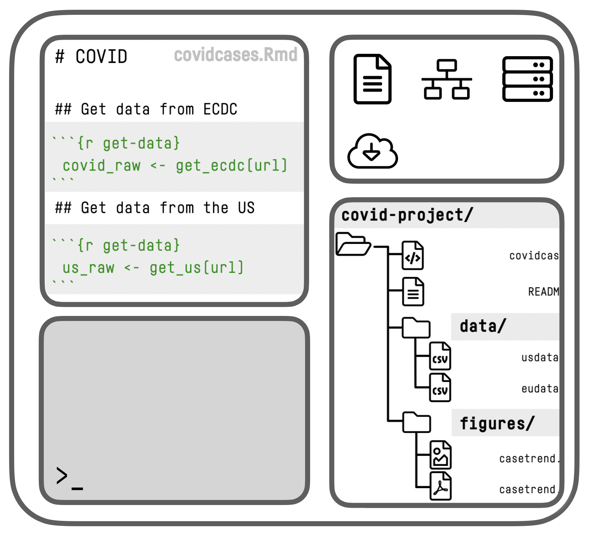
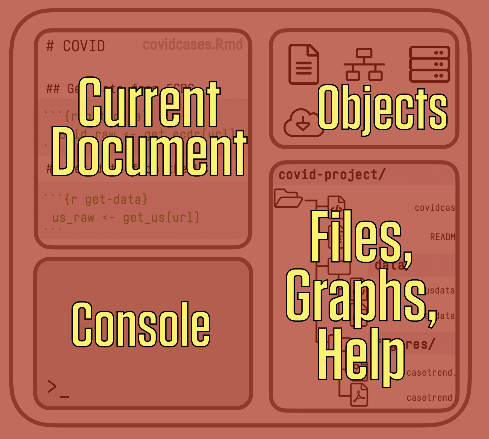
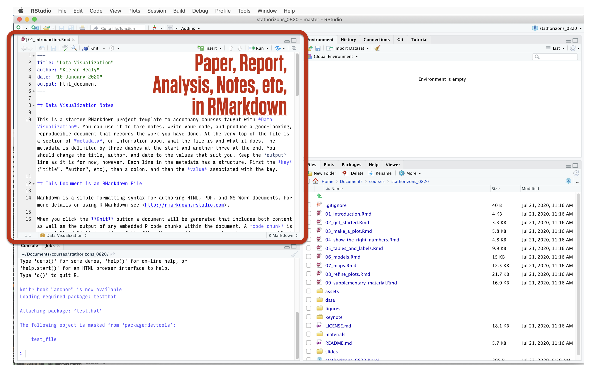
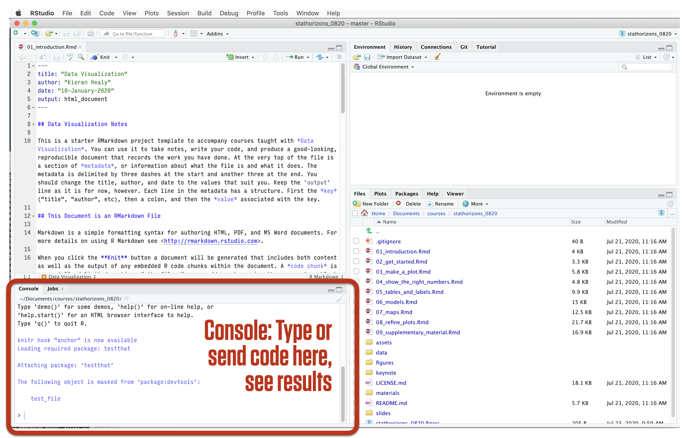
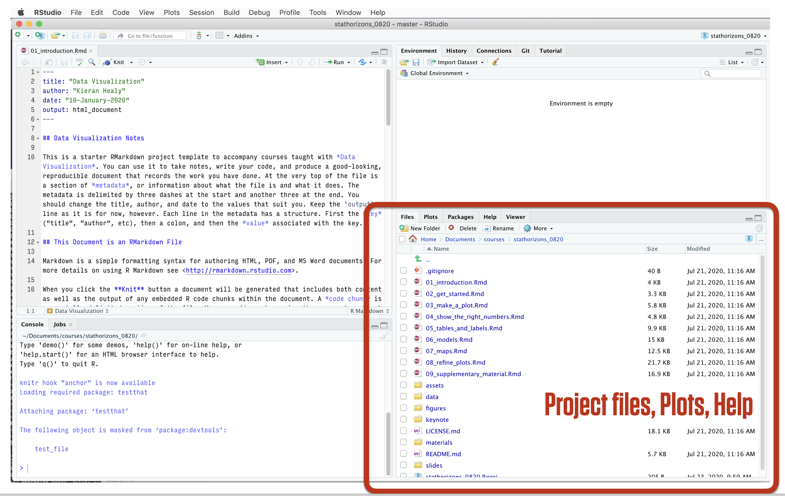
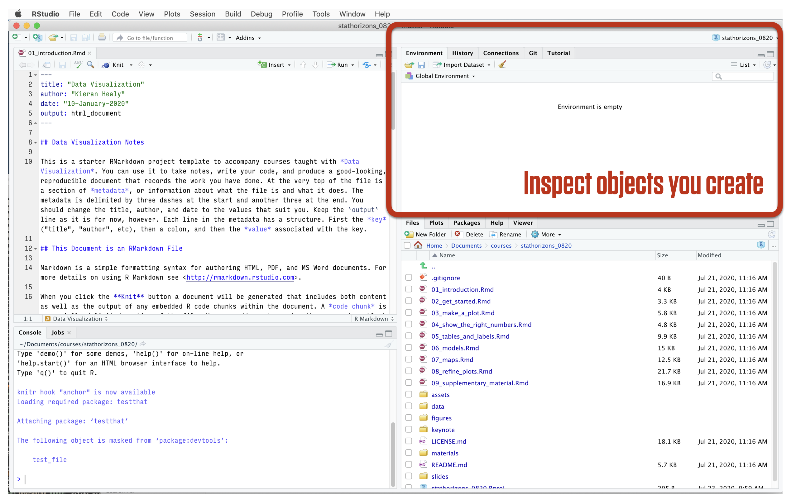
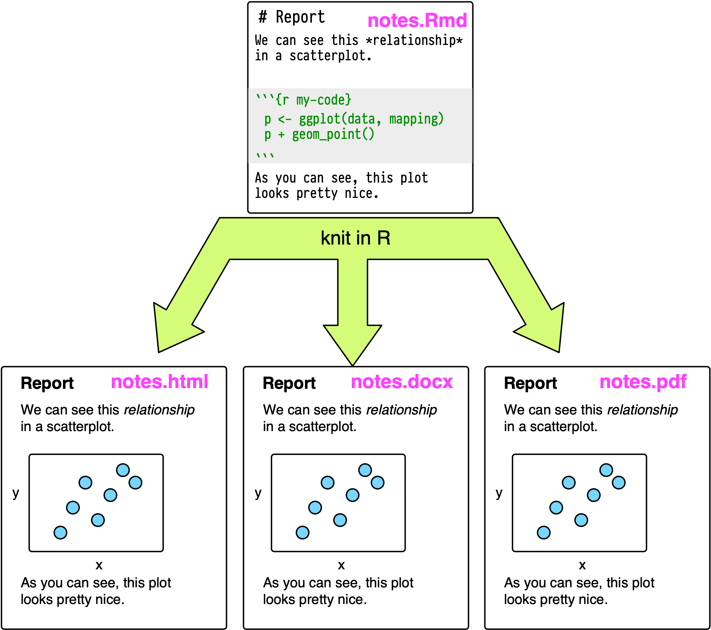
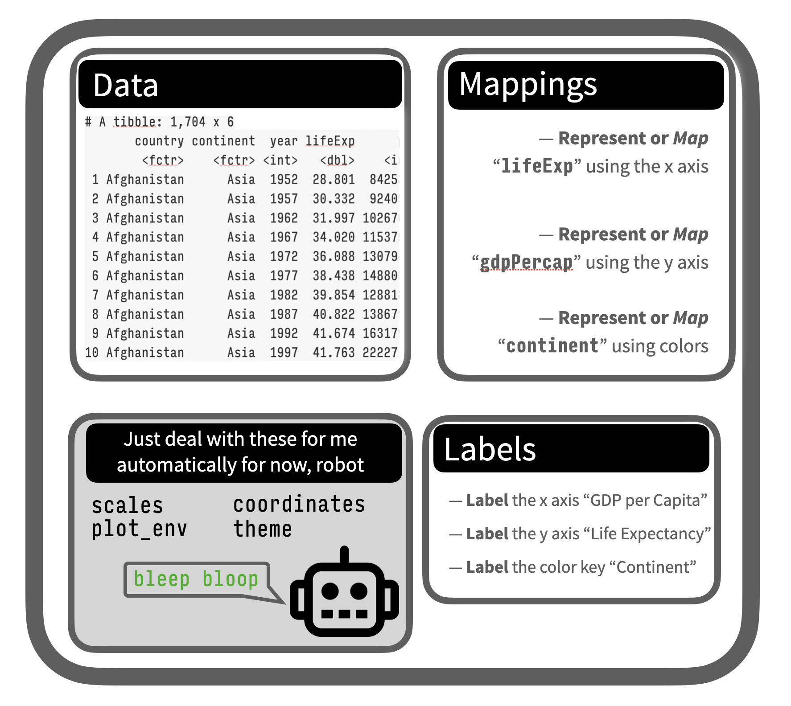
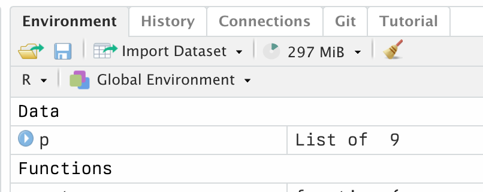
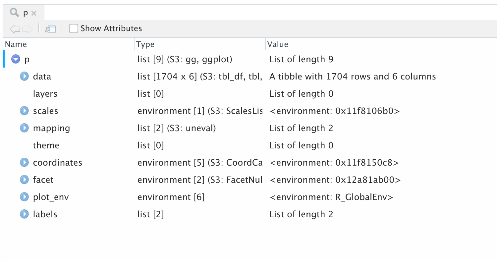

```{r packages, include=FALSE}
library(flipbookr)
library(here)
library(kjhslides)
```


```{r setup, include=FALSE}

kjh_register_tenso()
kjh_set_knitr_opts()
kjh_set_slide_theme()
kjh_set_xaringan_opts()


# Safe
```

class: center middle main-title section-title-1

# Finding your way in<br />.kjh-lblue[R] and .kjh-lblue[RStudio]

.class-info[

**Data Visualization: Session 2**

.light[Kieran Healy<br>
Code Horizons, May 2022]

]


---

layout: false
class: center middle main-title main-title-inv

# .middle.huge.squish4[We want to<br />.kjh-orange[draw graphs]<br />.kjh-green[reproducibly]]


---
layout: false

.left[]

.right[]


---

layout: true
class: title title-1

---

# Abstraction in software

.pull-left[

## Less

- Easy things are awkward

- Hard things are straightforward

- Really hard things are possible
]


.pull-right[

## More

- Easy things are trivial

- Hard things are very awkward

- Really hard things are impossible
]


.center.large[Compare:  D3, Grid, ggplot, Stata,  Excel]


---

# Two ways to use R and ggplot

## 1. Do everything in R from start to finish


`Raw data |> Read, Clean, Analyse |> Tidy table |>  Make figures`

--

## 2. Just hand ggplot a table of results

`Stata/SAS/etc |> Tidy table |> Read in to R |> Make figures`


---

class: center middle main-title section-title-1

# .huge[The .kjh-lblue[RStudio] IDE]

---
layout: false 
class: bottom
background-image: url("img/02_ide_control_room.png")
background-size: cover

## .huge.right.bottom.squish4.kjh-grey[An IDE for R]

---
layout: false
class: bottom
background-image: url("img/02_ide_kitchen.png")
background-size: cover

## .huge.right.bottom.squish4.kjh-grey[An IDE for Meals]


---
layout: false

.center[]

.right.w90.small[RStudio at startup]

---
layout: false

.center[]

.right.w90.small[RStudio schematic overview]

---
layout: false

.center[]

.right.w90.small[RStudio schematic overview]

---

layout: false
class: center middle

## .middle.huge.squish4[Think in terms of<br />.kjh-orange[Data] + .kjh-green[Transformations], written out as code, rather than a series of point-and-click steps]


---

layout: false
class: center middle

## .middle.huge.squish4[Our starting .kjh-orange[data] + our .kjh-green[code] is what's "real" in our projects, not the final output or any intermediate objects]

---
layout: false

.center[]

.right.w90.small[RStudio at startup]

---
layout: false

.center[]

.right.w90.small[RStudio at startup]

---
layout: false

.center[]

.right.w90.small[RStudio at startup]

---
layout: false

.center[]

.right.w90.small[RStudio at startup]

---
layout: false

.center[]

.right.w90.small[RStudio at startup]


---

class: center middle main-title section-title-1

# .large.squish4[Use .kjh-yellow[RMarkdown] to .kjh-orange[produce] and .kjh-green[reproduce]  work]

---

layout: true
class: title title-1

---

# Where we want to end up

.center[]  

---

# Where we want to end up

.center[]  

---

# Where we want to end up

.center[]  

---

# How to get there?

.pull-left[] 

.pull-right[

- We could write an **R script** with some notes inside, using it to create some figures and tables, paste them into our document.

- This will work, but we can do better.

]

---

# We can .kjh-yellow[make] this ...


.pull-left[]  


.pull-right.large[This is what we want to end up with. Nicely-formatted text, plots, and tables. In .kjh-red[an "Office" approach] we write the document and paste in the figures and tables.]

---

# ... by .kjh-green[writing] this

.pull-left[]  

.pull-right.large[In a .kjh-red[literate programming] approach, chunks of code contained in documents are processed and then replaced with their output when the output document is produced.]

---

# The .kjh-pink[`code`] gets replaced by its .kjh-green[output]


.pull-left[]

.pull-right[]

---

layout: false
class: center


---

.center[]  

---

.pull-left[]  

--

.right.large[

- This approach has its limitations, but it's _very_ useful and has many benefits.

]


---

.pull-left[]  


.pull-right[- When learning these workflows, stick with the defaults at the beginning. Later, you can customize the look of the output in all kinds of ways.

- The slides for this course were written in RMarkdown. Many of the resources for R that you'll find online (including websites and full-length books) were as well.]


---

layout: true
class: title title-1

---

# The right frame of mind

- This is like learning how to drive a car, or how to cook in a kitchen ... or learning to speak a language.

--

- After some orientation to what's where, you will learn best by _doing_.

--

- Software is a pain, but you won't crash the car or burn your house down. 

???

- Don't be afraid of the IDE or code. Expect to be frustrated, and don't be surprised when things go wrong. Things will go wrong _constantly_. The software is a very powerful, very obedient, and _very_ dumb robot.

- But every time things "don't work", and every time you diagnose and fix them, you will become a little more adept at noticing and fixing these errors. And you will start to accumulate practical knowledge of common failures.

- So be like Jacques and keep at it.

---

layout: false
class: main-title main-title-inv center middle

# .huge.squish4[TYPE OUT<br />YOUR CODE<br />.kjh-orange[BY HAND]]

---

.center[]

---

layout: true
class: center middle main-title section-title-1

---

# .huge.middle.squish4[<br />GETTING <br />O.kjh-lblue[R]IENTED]

---

layout: true
class: title title-1

---

# Loading the tidyverse libraries

```{r 02-about-r-1, message = TRUE}
library(tidyverse)
```

- The tidyverse has several components. 

- We'll return to this message about Conflicts later.

- Again, the code and messages you see here is actual R output, produced at the same time as the slide.

---

# Tidyverse components

.pull-left[

- .kjh-green[**`library`**]`(tidyverse)`
- `Loading tidyverse: ggplot2`
- `Loading tidyverse: tibble`
- `Loading tidyverse: tidyr`
- `Loading tidyverse: readr`
- `Loading tidyverse: purrr`
- `Loading tidyverse: dplyr`
]

--

.pull-right[
- Load the package and ...
- `<|` **Draw graphs**
- `<|` **Nicer data tables**
- `<|` **Tidy your data**
- `<|` **Get data into R**
- `<|` **Fancy Iteration**
- `<|` **Action verbs for tables**

]

---

# What R looks like


Code you can type and run:

```{r 02-about-r-2 }
## Inside code chunks, lines beginning with a # character are comments
## Comments are ignored by R

my_numbers <- c(1, 1, 2, 4, 1, 3, 1, 5) # Anything after a # character is ignored as well

```

Output:

.smaller[Equivalent to running the code above, typing `my_numbers` at the console, and hitting enter.]

```{r 02-about-r-3 }
my_numbers 
```

---

# What R looks like

By convention, code output in documents is prefixed by `##`

```{r 02-about-r-4 }
my_numbers 
```


--

Also by convention, outputting vectors, etc, gets a counter keeping track of the number of elements. For example,

```{r 02-about-r-5 }
letters
```


---

layout: false
class: center middle

# .center.middle.huge.squish4[SOME THINGS<br />TO KNOW<br />ABOUT .kjh-orange[R]] 

---

layout: true
class: title title-1

---

# 0. .kjh-yellow[It's a calculator]

.pull-left[

- Arithmetic


```{r 02-about-r-6 }
(31 * 12) / 2^4
```

```{r 02-about-r-7 }
sqrt(25)
```

```{r 02-about-r-8 }
log(100)

log10(100)

```

]

--

.pull-right[

- Logic

```{r 02-about-r-9 }
4 < 10
4 > 2 & 1 > 0.5 # The "&" means "and"
4 < 2 | 1 > 0.5 # The "|" means "or"
4 < 2 | 1 < 0.5
```
]

---

# 0. .kjh-yellow[It's a calculator]

Logical equality and inequality (yielding a .kjh-green[`TRUE`] or .kjh-red[`FALSE`] result) is done with `==` and `!=`. Other logical operators include `<`, `>`, `<=`, `>=`, and `!` for negation. We'll use these in plots to filter data, test conditions, and so on.

.medium[

```{r 02-about-r-10 }
## A logical test
2 == 2 # Write `=` twice
```

```{r 02-about-r-11, eval = FALSE}
## This will cause an error, because R will think you are trying to assign a value
2 = 2

## Error in 2 = 2 : invalid (do_set) left-hand side to assignment
```

```{r 02-about-r-12 }
3 != 7 # Write `!` and then `=` to make `!=`
```
]

---

layout: true
class: title title-1

---

# 1. .kjh-yellow[Everything in R has a name]

```{r 02-about-r-13 }
my_numbers # We created this a few minutes ago

letters  # This one is built-in

pi  # Also built-in
```

---

# Some names are forbidden

Or it's a _really_ bad idea to try to use them 

```{r 02-about-r-14, eval = FALSE}

## Don't name objects with terms fo logical values, 
## or missing and null-value indicators

TRUE
FALSE
Inf
NaN 
NA 
NULL

## Don't name objects with terms that are also
## built-in functions for programming and flow-control

for
if
while
break
function
```

---

# 2. .kjh-yellow[Everything is an object]

There are a few built-in objects:


```{r 02-about-r-15 }
letters
```

--

```{r 02-about-r-16 }
pi
```

--

```{r 02-about-r-17 }

LETTERS
```

---

# 3. .kjh-yellow[You can create objects] 

--

In fact, this is mostly what we will be doing.

--

Objects are created by .kjh-pink[_assigning_] a thing to a name:

```{r 02-about-r-18 }
## name... gets ... this stuff
my_numbers <- c(1, 2, 3, 1, 3, 5, 25, 10)

## name ... gets ... the output of the function `c()`
your_numbers <- c(5, 31, 71, 1, 3, 21, 6, 52)
```

--

The .kjh-green[**`c()`**] function _combines_ or _concatenates_ things


The **assignment operator**, .kjh-pink[**`<-`**], performs the action of creating objects.

???

The core thing we do in R is _create objects_ by _assigning a thing to a name_. That thing is usually the output of some _function_. There are a lot of built-in functions.

We can create an object with the .kjh-green[**`c()`**] function and the *assignment operator*, `<-`. 


---

# The assignment operator

- The .kjh-pink[assignment operator] performs the action of creating objects:

--

- Use a keyboard shortcut to write it:

- Press .kjh-green[**`option`**] _and_ .kjh-green[**`-`**] on a Mac

- Press .kjh-green[**`alt`**] _and_ .kjh-green[**`-`**] on Windows


---

# Assignment with .kjh-green[**`=`**]

- You can use ".kjh-green[**`=`**]" as well as ".kjh-green[**`<-`**]" for assignment

```{r 02-about-r-19 }
my_numbers = c(1, 2, 3, 1, 3, 5, 25)

my_numbers
```


--

On the other hand, ".kjh-green[**`=`**]" has a different meaning when used in functions.

--

I'm going to use ".kjh-green[**`<-`**]" for assigment throughout. Just be consistent either way.

---

# Assignment with .kjh-green[**`=`**]

.center[]

???

--- 

layout: true
class: title title-1

---

# 4. Do things to objects with .kjh-green[functions]


```{r 02-about-r-20 }

## this object... gets ... the output of this function
my_numbers <- c(1, 2, 3, 1, 3, 5, 25, 10)

your_numbers <- c(5, 31, 71, 1, 3, 21, 6, 52)
```

```{r 02-about-r-21 }
my_numbers
```

- Functions can be identified by the parentheses after their names.

```{r 02-about-r-22 }
my_numbers 
```


```{r 02-about-r-23, eval = FALSE}
## If you run this you'll get an error
mean()
```

---

# What .kjh-green[functions] usually do

- They take .kjh-orange[**inputs**] to .kjh-pink[**arguments**]

- They perform .kjh-green[**actions**]

- They produce, or return, .kjh-lblue[**outputs**]

--

.pull-left[

### .kjh-lblue[`x`] .kjh-green[`<-`] .kjh-green[`c(`].kjh-orange[1, 2, 3, 1, 3, 5, 25, 10].kjh-green[`)`]

### .kjh-blue[`x`]

### .kjh-blue[`[1]  1  2  3  1  3  5 25 10`]

]
--

.pull-right[

### .kjh-green[**`mean`(**].kjh-pink[`x`] `=` .kjh-orange[`my_numbers`].kjh-green[**)**]

### .kjh-lblue[`[1] 6.25`]

]

---

# What .kjh-green[functions] usually do

.large[
```{r 02-about-r-24 }
## Get the mean of what? Of x.
## You need to tell the function what x is
mean(x = my_numbers)

mean(x = your_numbers)
```
]

--

If you don't _name_ the arguments, R assumes you are providing them in the order the function expects.

```{r 02-about-r-25 }
mean(your_numbers)
```

---

# What .kjh-green[functions] usually do

What arguments? Which order? Read the function's help page

```{r 02-about-r-26, eval=FALSE}
help(mean)
```

```{r 02-about-r-27, eval = FALSE}
## quicker
?mean
```

--

How to read an R help page ... 

---

# What .kjh-green[functions] usually do


Arguments often tell the function what to do in specific circumstances

```{r 02-about-r-28 }
missing_numbers <- c(1:10, NA, 20, 32, 50, 104, 32, 147, 99, NA, 45)

mean(missing_numbers)

mean(missing_numbers, na.rm = TRUE)
```

--

Or select from one of several options

```{r 02-about-r-29 }
## Look at ?mean to see what `trim` does
mean(missing_numbers, na.rm = TRUE, trim = 0.1)
```


---

# What .kjh-green[functions] usually do


.pull-left.w80[
There are all kinds of functions. They return different things.

```{r 02-about-r-30 }
summary(my_numbers)
```

]
--

.pull-left.w80[You can assign the output of a function to a name, which turns it into an object. (Otherwise it'll send its output to the console.)

```{r 02-about-r-31 }
my_summary <- summary(my_numbers)

my_summary
```

]
---

# What .kjh-green[functions] usually do

.pull-left.w80[Objects hang around in your work environment until they are overwritten by you, or are deleted.

```{r 02-about-r-32, eval = FALSE}
## rm() function removes objects
rm(my_summary)

my_summary

## Error: object 'my_summary' not found
```

]
---

# Functions can be .kjh-yellow[nested]

.pull-left.w80[
```{r 02-about-r-33 }
c(1:20)
```
]

--

.pull-left.w80[
```{r 02-about-r-34 }
summary(c(1:20))
```
]

.pull-left.w80[
```{r 02-about-r-35 }
names(summary(c(1:20)))
```
]
--


.pull-left.w80[
```{r 02-about-r-36 }
length(names(summary(c(1:20))))
```
]

--

.pull-left.w80[Nested functions are evaluated from the inside out.]

---

# Use the pipe operator: .kjh-pink[**`|>`**]

Instead of nesting functions in parentheses, we can use the .kjh-pink[_pipe operator_] to join them together:


```{r 02-about-r-37 }
c(1:20) |> summary() |> names() |>  length()
```

--

Read this operator as "_.kjh-pink[**and then**]_"

--

Better, vertical space is free in R:


```{r 02-about-r-38 }
c(1:20) |> 
  summary() |> 
  names() |> 
  length()
```

---

# Pipelines make code more .kjh-green[readable]

Not great, Bob:

```r
  serve(stir(pour_in_pan(whisk(crack_eggs(get_from_fridge(eggs), into = "bowl"), len = 40), temp = "med-high")))
```

--

Notice how the first thing you read is the last operation performed.

--

Really not much better:

.medium[
```r
serve(
  stir(
    pour_in_pan(
      whisk(
        crack_eggs(
          get_from_fridge(eggs), 
        into = "bowl"), 
      len = 40), 
    temp = "med-high")
  )
)
```
]
---

# Pipelines make code more .kjh-green[readable]

Much nicer:

.medium[
```r
eggs |> 
  get_from_fridge() |> 
  crack_eggs(into = "bowl") |> 
  whisk(len = 40) |> 
  pour_in_pan(temp = "med-high") |> 
  stir() |> 
  serve()

```
]
--

.pull-left.w60[We'll still use nested parentheses quite a bit, often in the context of a function working inside a pipeline. But it's good not to have too many levels of nesting.]

---


# The .kjh-yellow[magrittr] pipe: .kjh-pink[`%>%`]

- The pipe operator .kjh-pink[**`|>`**] was not part of Base R until very recently. Pipling was originally introduced in a package called `magrittr`, where it was written .kjh-pink[**`%>%`**] and behaved in very nearly* the same way as the base pipe now does. 

--

- The magrittr pipe continues to work. A lot of existing code uses it (e.g., my book!).

--

- _Sidenote:_ There are bunch of special operators in R that have the naming convention .kjh-pink[**`%something%`**]. For example .kjh-pink[**`%\*%`**] means "matrix multiply". We'll see more of them as we go. In this context the **`% %`** is sometimes pronounced "grapes".  

.footnote.tiny[.kjh-darkgrey[\*With the new pipe, you can only pass an object to the _first_ argument in a function. This is fine for most tidyverse pipelines, where the first argument is usually (implicitly) the data. But it does mean that most Base R functions will continue not to be easily piped, as most of them do not follow the convention of passing the current data as the first argument]]

---

# Functions are bundled into .kjh-yellow[packages]

--

All programming languages gain power and convenience by having libraries or packages of functions that extend the core abilities of the language. In R, packages are loaded into your working environment using the .kjh-green[**`library()`**] function.

--

```{r 02-about-r-39 }
## A package containing a dataset rather than functions
library(gapminder)

gapminder
```

---

# Functions are bundled into .kjh-yellow[packages]

--

.SMALL.squish2[You need only _install_ a package once (and occasionally update it). But you must _load_ the package in each R session before you can access its contents.]

.SMALL[

```{r 02-about-r-40, eval = FALSE}
## Do at least once for each package. Once done, not needed each time.
install.packages("palmerpenguins", repos = "http://cran.rstudio.com")

## Needed sometimes, especially after an R major version upgrade.
update.packages(repos = "http://cran.rstudio.com")

```


]

.SMALL[
```{r 02-about-r-41 }
## To load a package, usually at the start of your RMarkdown document or script file
library(palmerpenguins)
penguins
```
]
---

# Grabbing a single function with .kjh-green[**`::`**]

.pull-left.w70["Reach in" to an unloaded package and grab a function directly, using .kjh-green[`<package>::<function>`]]

--

.pull-left.w70[
```{r 02-about-r-42, message = FALSE, echo = FALSE}
gtsummary::theme_gtsummary_journal(journal = "jama")
#gtsummary::theme_gtsummary_compact()
```

.less-medium[
```{r 02-about-r-43 }
## A little glimpse of what we'll do soon
penguins |> 
  select(species, body_mass_g, sex) |> 
  gtsummary::tbl_summary(by = species) #<<
```
]
]
---

# Remember this warning about conflicts?


Notice how some functions in different packages have the same names.

--

Related concepts of _namespaces_ and _environments_.

---

# Scope of names
 
.small[
```{r 02-about-r-44 }
x <- c(1:10)
y <- c(90:100)

x

y
```
]
--

.small[
```r
mean()

## Error in mean.default() : argument "x" is missing, with no default
```
]
--
.small[
```{r 02-about-r-45 }
mean(x) # argument names are internal to functions

mean(x = x)

mean(x = y)

x

y

```
]

---

# 5. Objects come in .kjh-yellow[types] and .kjh-yellow[classes]

I'm going to speak somewhat loosely here for now, and gloss over some distinctions between object classes and data structures, as well as kinds of objects and their attributes.

--

The object inspector in RStudio is your friend.

--

You can ask an object what it is. 

```{r 02-about-r-46 }
class(my_numbers)
typeof(my_numbers)
```


---

# 5. Objects come in .kjh-yellow[types] and .kjh-yellow[classes]

Objects can have more than one (nested) class:

--

```{r 02-about-r-47 }
summary(my_numbers)

my_smry <- summary(my_numbers) # remember, outputs can be assigned to a name, creating an object

class(summary(my_numbers)) # functions can be nested, and are evaluated from the inside out

class(my_smry) # equivalent to the previous line
```

---

# 5. Objects come in .kjh-yellow[types] and .kjh-yellow[classes]


```{r 02-about-r-48 }
typeof(my_smry)
attributes(my_smry)

## In this case, the functions extract the corresponding attribute
class(my_smry)
names(my_smry)
```

---

# A .kjh-green[vector] is a fundamental kind of object

.pull-left.small.kjh-darkgrey[

[]  

- From Hadley Wickham, _Advanced R_

]

--

.pull-right[

```{r 02-about-r-49 }
my_int <- c(1, 3, 5, 6, 10)
is.integer(my_int)
is.double(my_int)

my_int <- as.integer(my_int)
is.integer(my_int)

my_chr <- c("Mary", "had", "a", "little", "lamb")
is.character(my_chr)

my_lgl <- c(TRUE, FALSE, TRUE)
is.logical(my_lgl)

```

]

---

# The most common types of .kjh-green[vector]

.pull-left.tiny.kjh-darkgrey[

[]  

- From Hadley Wickham, _Advanced R_

]

--

.pull-right.tiny[

```{r 02-about-r-50 }
## Factors are for storing categorical variables
x <- factor(c("Yes", "No", "No", "Maybe", "Yes", "Yes"))
x

summary(x) # Alphabetical order by default

typeof(x)       # A factor is a vector of integers 
attributes(x)   # ... with labels for its "levels" 
levels(x)
is.ordered(x)

```

]

???

HW: 

Categorical data, where values come from a fixed set of levels recorded in factor vectors.

Dates (with day resolution), which are recorded in Date vectors.

Date-times (with second or sub-second resolution), which are stored in POSIXct vectors.

Durations, which are stored in difftime vectors.

---


# Individual vectors can't be heterogenous 

Objects can be manually or automatically coerced from one class to another. Take care!

--

```{r 02-about-r-51 }
class(my_numbers)

my_new_vector <- c(my_numbers, "Apple")

my_new_vector # vectors are homogeneous/atomic

class(my_new_vector)
```

--

```{r 02-about-r-52 }
my_dbl <- c(2.1, 4.77, 30.111, 3.14519)
is.double(my_dbl)

my_dbl <- as.integer(my_dbl)

my_dbl

```


---

# Tibbles are a .kjh-yellow[list] of .kjh-green[vectors] of various .kjh-pink[types]

.SMALL[
```{r 02-about-r-53 }
gapminder # tibbles and data frames can contain vectors of different types

class(gapminder)
typeof(gapminder) # hmm

```
]

Underneath, most complex R objects are some kind of list with different components.


???

- A _data frame_ is a list of vectors of the same length, where the vectors can be of different types (e.g. numeric, character, logical, etc)

- A _tibble_ is an enhanced data frame 

Tibbles have an enhanced print method, never coerce strings to factors, and provide stricter subsetting methods. (HW)

Again the object inspector is helpful here

---

# Classes can be nested

Some classes build on and enhance the properties of simpler classes.

.pull-left[

Base R's trusty .kjh-lblue[**`data.frame`**]
  
```{r 02-about-r-54 }
library(socviz)
titanic
class(titanic)
```

```{r 02-about-r-55 }
## The `$` idiom picks out a named column here; 
## more generally, the named element of a list
titanic$percent  
```

]
--

.pull-right[

The Tidyverse's enhanced .kjh-lblue[**`tibble`**]

```{r 02-about-r-56 }
## tibbles are build on data frames 
class(titanic)

titanic_tb <- as_tibble(titanic) 

titanic_tb
class(titanic_tb)
```
 
]
---

# All of this will matter later on

```{r 02-about-r-57 }
gss_sm
```

--

.pull-left.w80.squish2[Tidyverse tools are generally _type safe_, meaning their functions return the same type of thing every time, or fail if they cannot do this. So it's good to know about the various data types.]

---

# 6. .kjh-yellow[Arithmetic on vectors]

.pull-left.w60[In R, all numbers are vectors of different sorts. Even single numbers ("scalars") are conceptually vectors of length 1.]

--

.pull-left.w60[Arithmetic on vectors\* follows a series of _recycling rules_ that favor ease of expression of vectorized, "elementwise" operations.]

.pull-left.w60.footnote.small[*And arrays, too.]

---

# 6. .kjh-yellow[Arithmetic on vectors]

See if you can predict what the following operations do: 

```{r 02-about-r-58 }
my_numbers

result1 <- my_numbers + 1

```

--

```{r 02-about-r-59 }
result1
```

--

```{r 02-about-r-60 }
result2 <- my_numbers + my_numbers

```

--

```{r 02-about-r-61 }
result2
```

--

```{r 02-about-r-62, warning=TRUE}
two_nums <- c(5, 10)

result3 <- my_numbers + two_nums

```

--

```{r 02-about-r-63 }
result3
```

---

# 6. .kjh-yellow[Arithmetic on vectors]

```{r 02-about-r-64, warning=TRUE}
three_nums <- c(1, 5, 10)

result4 <- my_numbers + three_nums

```

--

```{r 02-about-r-65 }
result4
```

Note that you got a **warning** here. R will still do what you told it do, though! Don't ignore warnings until you understand what they mean.

---

# 7. .kjh-yellow[R will be] .kjh-red[frustrating]

--

- The IDE tries its best to help you. Learn to attend to what it is trying to say.

.left[]  

--

.left[]  

--

.left[]  


---

class: center middle main-title section-title-1

# .huge.kjh-lblue[Let's Go!]

---

# Time to make a plot

Like before:

```{r 02-about-r-66 }
gapminder
```

---

# Like before

.pull-left.w35[


```{r codefig-plot-2, message=FALSE, fig.show="hide", fig.width=5.8, fig.height=5.5}
library(tidyverse)
library(gapminder)

p <- ggplot(data = gapminder, 
            mapping = aes(x = gdpPercap, 
                          y = lifeExp)) 

p + geom_point()
```

]

--

.pull-right.w60[
```{r 02-about-r-67, echo=FALSE}
knitr::include_graphics(
  knitr::fig_chunk("codefig-plot-2", "png")
)
```
]

---

# What we did

.pull-left.w40[


```{r 02-about-r-68, message=FALSE, eval = FALSE, echo = TRUE}
library(tidyverse)

library(gapminder)
```
]

.pull-right.w60[

- Load the packages we need: `tidyverse` and `gapminder`
]

--

.pull-left.w40[

```{r 02-about-r-69, message=FALSE, eval = FALSE, echo = TRUE}

p <- ggplot(data = gapminder, 
            mapping = aes(x = gdpPercap, 
                          y = lifeExp)) 
```
]

.pull-right.w60[

- New object named .kjh-lblue[**`p`**] .kjh-pink[`gets`] the output of the .kjh-green[`ggplot()` _function_], given these .kjh-orange[_arguments_]
- Notice how one of the arguments, .kjh-orange[`mapping`], is itself taking the output of a function named .kjh-green[`aes()`]
] 

--

.pull-left.w40[

```{r 02-about-r-70, message=FALSE, eval = FALSE, echo = TRUE}


p + geom_point()

```
]

.pull-right.w60[
- Show me the output of the .kjh-lblue[**`p`**] object and the .kjh-green[`geom_point()`] function.
- The .kjh-pink[`+`] here acts just like the .kjh-pink[`|>`] pipe, but for ggplot functions only. (This is an accident of history.)
]

---

# And what is R doing?

- .huge[R objects are just lists of .kjh-orange[stuff to use] or .kjh-green[things to do]]

---
layout: false
class: bottom
background-image: url("img/02_r_object_bento_box.png")
background-size: cover

## .huge.right.bottom.squish4.kjh-grey[Objects are like Bento Boxes]

---
layout: false

.center[]

.right.w90.huge[The .kjh-lblue[`p`] object]

---
layout: false

.center[]

.right.w90.huge[Peek in with the object inspector]


---
layout: false
 
.center[]

.right.w90.huge[Peek in with the object inspector]
   

