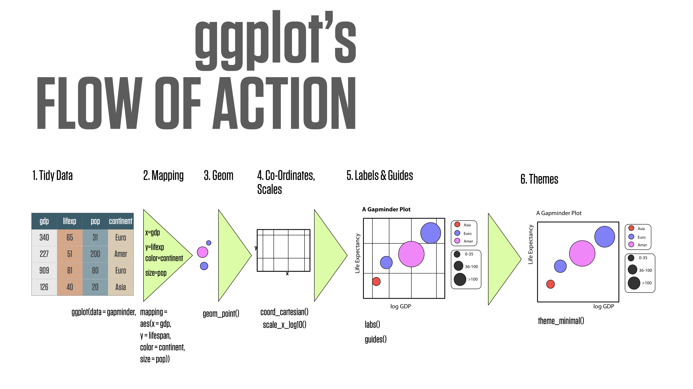
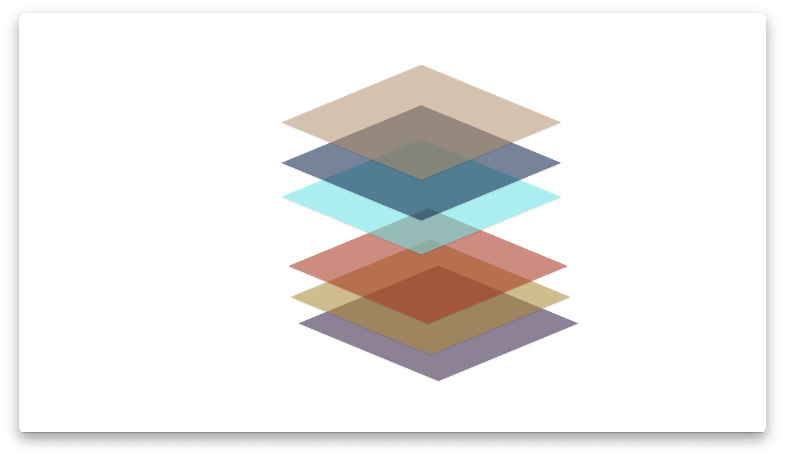
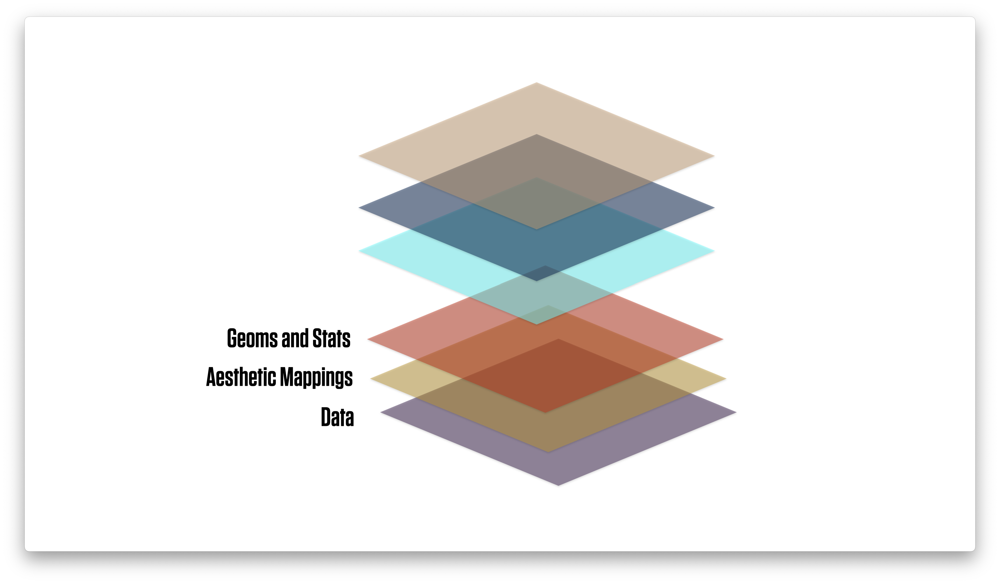
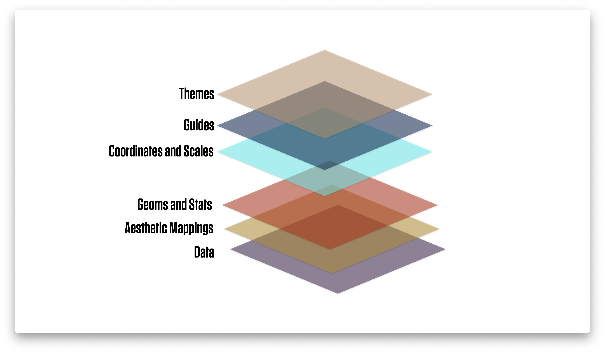
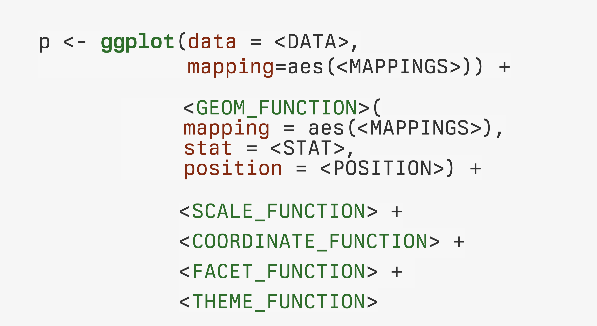
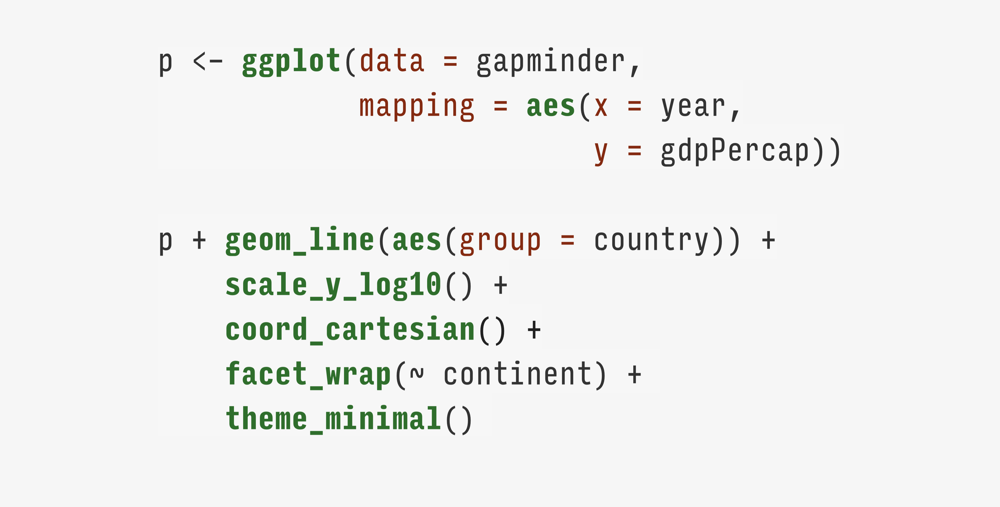

```{r packages, include=FALSE}
library(flipbookr)
library(here)
library(tidyverse)
library(kjhslides)
```


```{r setup, include=FALSE}
## Configure the slides

kjh_register_tenso()    # Default fonts. Comment out if you don't have Tenso and Berkeley fonts.
kjh_set_knitr_opts()    
kjh_set_slide_theme()   # ggplot theme to go with slides. Set tenso = FALSE if necessary.
kjh_set_xaringan_opts()

```


class: center middle main-title section-title-1

# Work with .kjh-lblue[dplyr] and .kjh-yellow[ggplot]

.class-info[

**Data Visualization: Session 5**

.light[Kieran Healy<br>
Code Horizons, May 2022
]

]


---

layout: true
class: title title-1

---

# Load our libraries

.SMALL[
```{r 03a-dplyr-basics-2, message = TRUE}
library(here)      # manage file paths
library(socviz)    # data and some useful functions
library(tidyverse) # your friend and mine
```
]

---

# Tidyverse components, again

.pull-left.w45[

- .kjh-green[**`library`**]`(tidyverse)`
- `Loading tidyverse: ggplot2`
- `Loading tidyverse: tibble`
- `Loading tidyverse: tidyr`
- `Loading tidyverse: readr`
- `Loading tidyverse: purrr`
- `Loading tidyverse: dplyr`
]

--

.pull-right.w55[
- Call the package and ...
- `<|` **Draw graphs**
- `<|` **Nicer data tables**
- `<|` **Tidy your data**
- `<|` **Get data into R**
- `<|` **Fancy Iteration**
- `<|` **Action verbs for tables**

]

---


# Other tidyverse components

.top[.pull-left.w15[   
- `forcats`
- `haven`
- `lubridate`
- `readxl`
- `stringr`
- `reprex`
]]

--

.top[.pull-right.w85[
- `<|` **Deal with factors**
- `<|` **Import Stata, SPSS, etc**
- `<|` **Dates, Durations, Times**
- `<|` **Import from spreadsheets**
- `<|` **Strings and Regular Expressions**
- `<|` **Make reproducible examples**
]]

--
.left.bottom[.footnote[Not all of these are attached when we do `library(tidyverse)`]]


---
layout: false
class: main-title main-title-inv center middle 


.center[]

---

class: main-title main-title-inv center middle 

.center[]


---

class: main-title main-title-inv center middle 

.center[]


---

class: main-title main-title-inv center middle 

.center[]


---

layout: true
class: title title-1

---

class: center middle main-title section-title-1

# .huge[Feeding .kjh-yellow[data] to .kjh-lblue[ggplot]]

---

layout: false
class: center middle

## .middle.huge.squish4[.kjh-orange[Transform and summarize first.]<br />.kjh-lblue[Then send your clean tables to ggplot.]]

---

class: right bottom main-title section-title-1

## .huge.right.bottom.squish4.kjh-yellow[Crosstabulation<br />and .kjh-lblue[beyond]]

---

layout: true
class: title title-1

---


# U.S. General Social Survey data: .kjh-pink[`gss_sm`]

```{r}
gss_sm  
```

- We often want summary tables or graphs of data like this.

---


# Two-way tables: Row percents

```{r, echo=FALSE}
gss_sm |> 
  janitor::tabyl(bigregion, religion) |> 
  janitor::adorn_totals(where = "col") |> 
  janitor::adorn_percentages() |> 
  janitor::adorn_pct_formatting(affix_sign = FALSE) |> 
  knitr::kable()  

```

---

# Two-way tables: Column percents

```{r, echo = FALSE}

gss_sm |> 
  janitor::tabyl(bigregion, religion) |> 
  janitor::adorn_totals(where = "row") |> 
  janitor::adorn_percentages(denominator = "col") |> 
  janitor::adorn_pct_formatting(affix_sign = FALSE) |> 
  knitr::kable()  
```

---

# Two-way tables: Full marginals

```{r, echo = FALSE}

gss_sm |> 
  janitor::tabyl(bigregion, religion) |> 
  janitor::adorn_percentages(denominator = "all") |> 
  janitor::adorn_pct_formatting(affix_sign = FALSE) |> 
  knitr::kable()  
```

---

# .kjh-yellow[dplyr] lets you work with tibbles

.pull-left-wide[
- Remember, tibbles are tables of data where the columns can be of different types, such as numeric, logical, character, factor, etc.]

--

.pull-left-wide[
- We'll use dplyr to _transform_ and _summarize_ our data.
]

--
.pull-left-wide[

- We'll use the pipe operator, .kjh-pink[**`|>`**], to chain together sequences of actions on our tables.

]
---

layout: false
class: center

# .huge.middle.squish4[`dplyr` draws on the logic and language of  .kjh-green[database queries], where the focus is on manipulating tables]

---

layout: true
class: title title-1

---

# Some .kjh-orange[actions] to take on a single table 

--

.pull-left.w80[
- .kjh-orange[**Group**] the data at the level we want, such as “_Religion by Region_” or _“Children by School_”.

- .kjh-orange[**Subset**] either the rows or columns of or table.

- .kjh-orange[**Mutate**] the data. That is, change something at the _current_ level of grouping.  Mutating adds new columns to the table, or changes the content of an existing column. It never changes the number of rows.

- .kjh-orange[**Summarize**] or aggregate the data. That is, make something new at a _higher_ level of grouping. E.g., calculate means or counts by some grouping variable. This will generally result in a smaller, _summary_ table.
]

---

# Each .kjh-orange[action] is implemented by a .kjh-green[function] 

--
.pull-left-wide[
- **Group** using  .kjh-green[**`group_by()`**].
]

--

.pull-left-wide[
- **Subset** has one action for rows and one for columns. We .kjh-green[**`filter()`**] rows and .kjh-green[**`select()`**] columns. 
]
--
.pull-left-wide[
- **Mutate** tables (i.e. add new columns, or re-make existing ones) using .kjh-green[**`mutate()`**].
]
--

.pull-left-wide[
- **Summarize** tables (i.e. perform aggregating calculations) using .kjh-green[**`summarize()`**].
]

---

# U.S. General Social Survey data: .kjh-pink[`gss_sm`]

```{r 03a-dplyr-basics-3 }
gss_sm
```

Notice again how the tibble already tells us a lot.


---

# Summarizing a Table

- Here's what we're going to do:

.center[]

---

# Summarizing a Table

- We're just taking a look at the relevant columns here. We don't need to narrow it like this to do our summary, though.


```{r 03a-dplyr-basics-4 }
gss_sm |> 
  select(id, bigregion, religion) 
```


---

# Group by .kjh-orange[_one_] column or variable

```{r 03a-dplyr-basics-5 }

gss_sm |> 
  group_by(bigregion) #<<

```

Grouping just changes the logical structure of the tibble. 

---
`r chunk_reveal("reveal-pipe1", widths = c(35,65), title = "# Summarizing a Table")`

```{r reveal-pipe1, include = FALSE}
gss_sm |>  
  select(id, bigregion, religion)

```
---

# Pipelines carry assumptions forward

.small[
```{r 03a-dplyr-basics-9 }
gss_sm |> 
  group_by(bigregion, religion) |> #<<
  summarize(total = n()) |> 
  mutate(freq = total / sum(total),
           pct = round((freq*100), 1))
```
]

Groups are carried forward till summarized or explicitly ungrouped

--

Summary calculations are done on the innermost group, which then "disappears". (Notice how it's no longer a group in the output.)

---

# Pipelines carry assumptions forward

.small[
```{r 03a-dplyr-basics-10 }
gss_sm |> 
  group_by(bigregion, religion) |> 
  summarize(total = n()) |> 
  mutate(freq = total / sum(total),
           pct = round((freq*100), 1)) #<<
```
]

.kjh-green[**`mutate()`**] is quite clever. See how we can immediately use **`freq`**, even though we are creating it in the same .kjh-green[**`mutate()`**] expression.

---

# Convenience functions

.small[

```{r 03a-dplyr-basics-11 }
gss_sm |> 
  group_by(bigregion, religion) |> #<<
  summarize(total = n()) |> #<<
  mutate(freq = total / sum(total),
           pct = round((freq*100), 1)) 
```
]

We're going to be doing this .kjh-green[**`group_by()`**] ... .kjh-green[**`n()`**] step a lot. Some shorthand for it would be useful.

---

# Three options for counting up rows

.pull-left-3[

- .SMALL.squish3[Do it yourself with .kjh-green[**`n()`**]]

.SMALL[
```{r 03a-dplyr-basics-12 }
gss_sm |> 
  group_by(bigregion, religion) |> #<<
  summarize(n = n()) #<<
```
]

- .small.squish3[Result is a grouped tibble.]
]

--

.pull-middle-3[

- .SMALL.squish3[use .kjh-green[**`tally()`**]]

.SMALL[
```{r 03a-dplyr-basics-13 }
gss_sm |> 
  group_by(bigregion, religion) |> 
  tally() #<<
```
]

- .small.squish3[Group it yourself; result is grouped.]
]

--

.pull-right-3[

- .SMALL.squish3[use .kjh-green[**`count()`**]]

.SMALL[
```{r 03a-dplyr-basics-14 }
gss_sm |> 
  count(bigregion, religion) #<<
```
]

- .small.squish3[One step; result is not grouped.]
]

---


# Pipelined tables can be quickly checked

.pull-left[

```{r 03a-dplyr-basics-22 }
rel_by_region <- gss_sm |> 
  count(bigregion, religion) |> 
  mutate(pct = round((n/sum(n))*100, 1)) 

rel_by_region
```

Hm, did I sum over right group?

]

--
.pull-right[

```{r 03a-dplyr-basics-23 }
## Each region should sum to ~100
rel_by_region |> 
  group_by(bigregion) |> 
  summarize(total = sum(pct)) 

```

No! What has gone wrong here?

]

---

# Pipelined tables can be quickly checked

.pull-left[

```{r 03a-dplyr-basics-24 }
rel_by_region <- gss_sm |> 
  count(bigregion, religion) |> #<< 
  mutate(pct = round((n/sum(n))*100, 1)) 
```

.SMALL.squish3[.kjh-green[**`count()`**] returns ungrouped results, so there are no groups carry forward to the .kjh-green[**`mutate()`**] step.]

```{r 03a-dplyr-basics-25 }
rel_by_region |> 
  summarize(total = sum(pct))
```

.SMALL.squish3[With .kjh-green[**`count()`**], the `pct` values here are the marginals for the whole table.]

]

--
.pull-right[

```{r 03a-dplyr-basics-26 }
rel_by_region <- gss_sm |> 
  group_by(bigregion, religion) |> #<<
  tally() |> #<<
  mutate(pct = round((n/sum(n))*100, 1)) 
```

```{r 03a-dplyr-basics-27 }
# Check
rel_by_region |> 
  group_by(bigregion) |> 
  summarize(total = sum(pct))

```

.SMALL.squish3[.kjh-green[**`group_by()`**] and .kjh-green[**`tally()`**] returns a grouped result. We get some rounding error because we used .kjh-green[**`round()`**] after summing originally.]
]


---

# Two lessons

## Check your tables!

-     Pipelines feed their content forward, so you need to make sure your results are not incorrect.

--

- Often, complex tables and graphs can be disturbingly plausible even when wrong.

--

- So, figure out what the result should be and test it!

--

- Starting with simple or toy cases can help with this process.

---

# Two lessons

## Inspect your pipes!

- Understand pipelines by running them forward or peeling them back a step at a time.

- This is a _very_ effective way to understand your own and other people's code.

---

# Pass your pipeline on to ... a .kjh-yellow[table]

```{r 03a-dplyr-basics-15, eval = FALSE}
gss_sm |> 
  count(bigregion, religion) |> 
  pivot_wider(names_from = bigregion, values_from = n) |>  #<<
  kable()  
```


.small[
```{r 03a-dplyr-basics-16, echo = FALSE}
gss_sm |> 
  count(bigregion, religion) |> 
  pivot_wider(names_from = bigregion, values_from = n) |> 
  knitr::kable()  
```
]


---

# Pass your pipeline on to a .kjh-yellow[graph]

.SMALL[
```{r 03a-dplyr-basics-17, fig.height=4, fig.width=15}
gss_sm |> 
  group_by(bigregion, religion) |> 
  tally() |> 
  mutate(pct = round((n/sum(n))*100), 1) |> 
  drop_na() |> 
  ggplot(mapping = aes(x = pct, y = reorder(religion, -pct), fill = religion)) + #<<
  geom_col() + #<<
    labs(x = "Percent", y = NULL) +
    guides(fill = "none") + 
    facet_wrap(~ bigregion, nrow = 1)
```
]

---

layout: false
class: center middle

## .middle.huge.squish4[.kjh-orange[Use `dplyr` pipelines to create summary tables.]<br />.kjh-lblue[Then send your clean tables to `ggplot`.]]

---

class: right bottom main-title section-title-1

## .huge.right.bottom.squish4[.kjh-lblue[Facets] .kjh-yellow[are often<br />better than] .kjh-grey[Guides]]


---

layout: true
class: title title-1

---

# Let's put that table in an object


```{r}
rel_by_region <- gss_sm |> 
  group_by(bigregion, religion) |> 
  tally() |> 
  mutate(pct = round((n/sum(n))*100), 1) |> 
  drop_na()


rel_by_region
```

---

# We might write ...

```{r}
p <- ggplot(data = rel_by_region, 
                mapping = aes(x = bigregion, 
                              y = pct, 
                              fill = religion))
p_out <- p + geom_col(position = "dodge") +
    labs(x = "Region",
         y = "Percent", 
         fill = "Religion") 
```

---

# We might write ...

```{r, echo = FALSE, fig.height=7, fig.width=12}
p_out
```


---

# Is this an effective graph? .kjh-red[Not really!]

```{r, echo = FALSE, fig.height=7, fig.width=12}
p_out
```

---

# Try .kjh-lblue[faceting] instead

```{r}
p <- ggplot(data = rel_by_region, 
                mapping = aes(x = pct, #<<
                              y = reorder(religion, -pct), #<<
                              fill = religion))
p_out_facet <- p + geom_col() +
  guides(fill = "none") + 
  facet_wrap(~ bigregion, nrow = 1) +
  labs(x = "Percent",
       y = NULL) 

```

- Putting categories on the y-axis is a very useful trick.

- Faceting reduces the number of guides the viewer needs to consult. 

---


# Try .kjh-lblue[faceting] instead

```{r, echo = FALSE, fig.height = 3.5, fig.width=15}
p_out_facet
```

### .kjh-green[Try putting categories on the y-axis. (And reorder them by x.)]

### .kjh-lblue[Try faceting variables instead of mapping them to color or shape.]

### .kjh-pink[Try to minimize the need for guides and legends.]


---

class: right bottom main-title section-title-1

## .huge.right.bottom.squish4[.kjh-yellow[Two kinds of] .kjh-lblue[facet]]

---

# Facet Children vs Age by Race

```{r, fig.width=10, fig.height=5}
p <-  ggplot(data = gss_sm,
             mapping = aes(x = age, y = childs))

p + geom_point(alpha = 0.2) + 
  geom_smooth() +
  facet_wrap(~ race)

```

---

# We can facet by more than one variable

```{r, fig.width=8, fig.height=5.5}
p <-  ggplot(data = gss_sm,
             mapping = aes(x = age, y = childs))

p + geom_point(alpha = 0.2) + 
  geom_smooth() +
  facet_wrap(~ sex + race) #<< 

```


---

# We can arrange .kjh-green[facet_wrap()] quite freely

```{r, fig.width=15, fig.height=5.5}
p <-  ggplot(data = gss_sm,
             mapping = aes(x = age, y = childs))

p + geom_point(alpha = 0.2) + 
  geom_smooth() +
  facet_wrap(~ sex + race, nrow = 1) #<< 

```


---

# .kjh-green[facet_grid()] is more like a true crosstab

```{r, fig.width=11, fig.height=6.5, warning = FALSE}
p + geom_point(alpha = 0.2) + 
  geom_smooth() +
  facet_grid(sex ~ race) #<< 

```


---

# Both can be exended to multi-way views

```{r, fig.width=11, fig.height=6.5, warning = FALSE}
p_out <- p + geom_point(alpha = 0.2) + 
  geom_smooth() +
  facet_grid(bigregion ~ race + sex) #<< 

```

---
layout: false

```{r, echo=FALSE, warning=FALSE, fig.width=12, fig.height=8}
p_out
```

---

class: center middle main-title section-title-1

# .huge[.kjh-lblue[What we've] .kjh-yellow[built-up]]

---

layout: true
class: title title-1
---

# Core Grammar

.center[]

---

# Grouped data; faceting

- Along with a few peeks at scale transformations, guide adjustments, and theme adjustment 

.center[]


---

# `dplyr` and Pipelining 

###  The elements of filtering and summarizing 

```{r}
gss_sm |> 
  group_by(bigregion, religion) |> 
  tally() |> 
  mutate(freq = n / sum(n),
         pct = round((freq*100), 1)) 
```


---

class: center middle main-title section-title-1

# .huge.kjh-lblue[Extend your vocabulary]

---

class: right bottom main-title section-title-1

## .huge.right.bottom.squish4.kjh-yellow[Some data on<br />Organ Donation]


---

# .kjh-pink[`organdata`] is in the `socviz` package

```{r}
organdata
```

---

# First looks

```{r, fig.width=10, fig.height=6}
p <- ggplot(data = organdata,
            mapping = aes(x = year, y = donors))
p + geom_point()
```

---

# First looks

```{r, fig.width=10, fig.height=6}
p <- ggplot(data = organdata,
            mapping = aes(x = year, y = donors))
p + geom_line() 
```

---

# First looks

```{r, fig.width=10, fig.height=6}
p <- ggplot(data = organdata,
            mapping = aes(x = year, y = donors))
p + geom_line(aes(group = country)) 
```


---

# First looks

```{r, fig.width=21, fig.height=8}
p <- ggplot(data = organdata,
            mapping = aes(x = year, y = donors))
p + geom_line() + 
  facet_wrap(~ country, nrow = 3)
```


---


class: right bottom main-title section-title-1

## .huge.right.bottom.squish4.kjh-yellow[Showing continuous measures by category]

---

# Boxplots: .kjh-green[`geom_boxplot()`]

```{r, fig.width = 15, fig.height=5}
## Pipeline the data directly; then it's implicitly the first argument to `ggplot()`
organdata |> 
  ggplot(mapping = aes(x = country, y = donors)) + 
  geom_boxplot()
```

---

# Put categories on the y-axis!

```{r, fig.width=10, fig.height=6}
organdata |> 
  ggplot(mapping = aes(x = donors, y = country)) + #<<
  geom_boxplot() +
  labs(y = NULL)
```

---

# Reorder y by the mean of x

```{r, fig.width=10, fig.height=6}
organdata |> 
  ggplot(mapping = aes(x = donors, y = reorder(country, donors, na.rm = TRUE))) + #<<
  geom_boxplot() +
  labs(y = NULL)
```

---

# (Reorder y by any statistic you like)

```{r, fig.width=10, fig.height=6}
organdata |> 
  ggplot(mapping = aes(x = donors, y = reorder(country, donors, sd, na.rm = TRUE))) + #<<
  geom_boxplot() +
  labs(y = NULL)
```

---

# .kjh-green[geom_boxplot()] knows `color` and `fill`

```{r, fig.width=10, fig.height=6}
organdata |> 
  ggplot(mapping = aes(x = donors, y = reorder(country, donors, na.rm = TRUE), fill = world)) + #<<
  geom_boxplot() +
  labs(y = NULL)
```


---

# These strategies are quite general

```{r, fig.width=10, fig.height=5.5}
organdata |> 
  ggplot(mapping = aes(x = donors, y = reorder(country, donors, na.rm = TRUE), color = world)) + 
  geom_point(size = rel(3)) + #<<
  labs(y = NULL)
```


---

# .kjh-green[geom-jitter()] can help with overplotting

```{r, fig.width=10, fig.height=6}
organdata |> 
  ggplot(mapping = aes(x = donors, y = reorder(country, donors, na.rm = TRUE), color = world)) + 
  geom_jitter(size = rel(3)) + #<<
  labs(y = NULL)
```

---

# Adjust with a `postion` argument

```{r, fig.width=10, fig.height=6}
organdata |> 
  ggplot(mapping = aes(x = donors, y = reorder(country, donors, na.rm = TRUE),
                       color = world)) + 
  geom_jitter(size = rel(3), position = position_jitter(height = 0.1)) + #<<
  labs(y = NULL)
```


---

class: right bottom main-title section-title-1

## .huge.right.bottom.squish4[.kjh-yellow[Summarize better with] .kjh-lblue[**`dplyr`**]]


