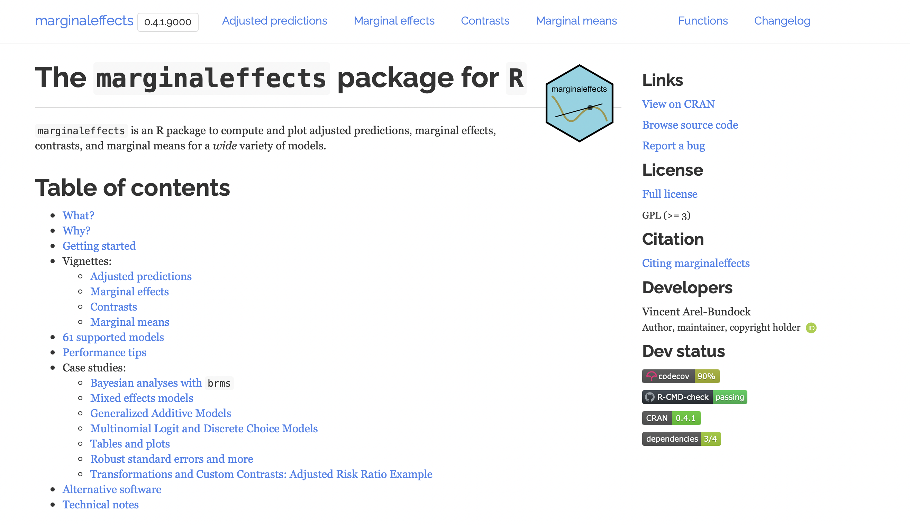
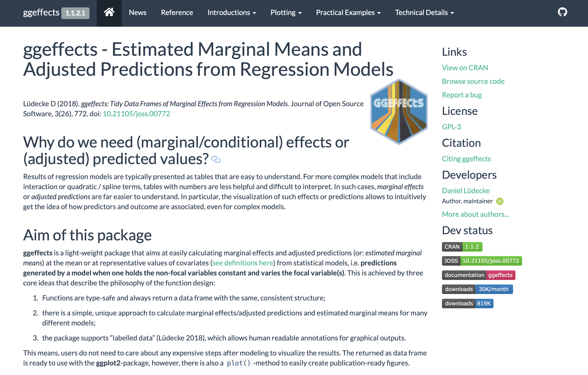

```{r note, include=FALSE}
## NB: By default the  template will create a new subdirectory with its files inside.
```


```{r packages, include=FALSE}
library(flipbookr)
library(here)
library(tidyverse)
library(kjhslides)
```


```{r setup, include=FALSE}
## Configure the slides

kjh_register_tenso()    # Default fonts. Comment out if you don't have Tenso and Berkeley fonts.
kjh_set_knitr_opts()    
kjh_set_slide_theme()   # ggplot theme to go with slides. Set tenso = FALSE if necessary.
kjh_set_xaringan_opts()

```


class: center middle main-title section-title-1

# Work with .kjh-yellow[Models]

.class-info[

**Data Visualization: Session 6**

.light[Kieran Healy<br>
Code Horizons, May 2022
]

]

---

layout: true
class: title title-1

---

# Load our libraries

.SMALL[
```{r 03a-dplyr-basics-2, message = TRUE}
library(here)      # manage file paths
library(socviz)    # data and some useful functions
library(tidyverse) # your friend and mine
library(gapminder) # Everyone's favorite dataset
library(broom)     # Tidy model output
library(marginaleffects) # Tidy marginal effects
library(modelsummary) # Tidy summary tables and graphs
library(scales)    # Format our axes and guides 
```
]

---

layout: true
class: title title-1

---

# We know .kjh-lblue[`ggplot`] can work with models


.pull-left.w45[
```{r codefig-model1, message=FALSE, fig.show="hide", fig.width=4.8, fig.height=4.5}
p <- gapminder |> 
  ggplot(mapping = aes(x = log(gdpPercap), 
                       y = lifeExp))  

p + geom_point(alpha=0.1) +
  geom_smooth(color = "tomato", 
              fill="tomato", 
              method = MASS::rlm) +
  geom_smooth(color = "steelblue", 
              fill="steelblue", 
              method = "lm") + 
  labs(title = "Robust and OLS fits")
```

- We know because `geoms` often do calculations in the background, via their `stat` functions.

]

--

.pull-right.w55[
```{r, echo=FALSE}
  knitr::include_graphics(
  knitr::fig_chunk("codefig-model1", "png"))
```
]


---

# And these can be complex ...


.pull-left.w45[
```{r codefig-model2, message=FALSE, fig.show="hide", fig.width=4.8, fig.height=4.5}

p + geom_point(alpha=0.1) +
    geom_smooth(color = "tomato", 
                method = "lm", 
                size = 1.2, 
                formula = y ~ splines::bs(x, 3), 
                se = FALSE)

```
]

--

.pull-right.w55[
```{r, echo=FALSE}
  knitr::include_graphics(
  knitr::fig_chunk("codefig-model2", "png"))
```
]

---

# And these can be complex ... but ...


.pull-left.w45[
```{r codefig-model3, message=FALSE, fig.show="hide", fig.width=4.8, fig.height=4.5}

p + geom_point(alpha=0.1) +
    geom_quantile(color = "tomato", 
                  size = 1.2, 
                  method = "rqss",
                  lambda = 1, 
                  quantiles = c(0.20, 0.5, 0.85))

```
]

--

.pull-right.w55[
```{r, echo=FALSE}
  knitr::include_graphics(
  knitr::fig_chunk("codefig-model3", "png"))
```

]


---

layout: false
class: center middle

## .middle.huge.squish4[.kjh-orange[Transform and summarize first.]<br />.kjh-lblue[Then send your clean tables to ggplot.]]

---

class: center middle main-title section-title-1

# .huge[.kjh-lblue[Look inside] .kjh-yellow[the box]]

---

layout: true
class: title title-1

---

# Again, objects are Bento Boxes of To-Do lists


```{r}
gapminder
```

---

# Fit a model

```{r}
out <- lm(formula = lifeExp ~ gdpPercap + log(pop) + continent, 
          data = gapminder)

summary(out)
```


---

# Poke around inside

- Use the Object Inspector to take a look

.left[]

---

class: right bottom main-title section-title-1

## .huge.right.bottom.squish4[.kjh-yellow[Predict from models:]<br /> .kjh-lblue[DIY method]]

---

# Behind the curtain

### .kjh-green[`predict()`] and its methods do a lot of work behind the scenes

- We won't usually need to do this stuff manually. But the idea is that the generic .kjh-green[`predict()`] function has _methods_ for specific sorts of models. Give it a model and some new data and it will produce predicted values for the new data. Here's an example/

---

# The labor-intensive way

```{r}
min_gdp <- min(gapminder$gdpPercap)
max_gdp <- max(gapminder$gdpPercap)
med_pop <- median(gapminder$pop)

# Make a grid of predictor values
pred_df <- expand_grid(gdpPercap = (seq(from = min_gdp,
                                        to = max_gdp,
                                        length.out = 100)),
                       pop = med_pop,
                       continent = c("Africa", "Americas",
                                     "Asia", "Europe", "Oceania"))

pred_df
```

---

# The labor-intensive way

```{r}
# Get the predicted values
pred_out <- predict(object = out,
                    newdata = pred_df,
                    interval = "confidence")
head(pred_out)

```

---

# The labor-intensive way

```{r}
# Bind them into one data frame. We can do this safely
# here because we know the row order by construction. 
# But this is not a safe approach in general.

pred_df <- cbind(pred_df, pred_out)
head(pred_df)
```

---

# The labor-intensive way

```{r}
p <- ggplot(data = subset(pred_df, continent %in% c("Europe", "Africa")),
            aes(x = gdpPercap,
                y = fit, 
                ymin = lwr, 
                ymax = upr,
                color = continent,
                fill = continent,
                group = continent))

# Use the original data as the point layer
p_out <- p + geom_point(data = subset(gapminder,
                             continent %in% c("Europe", "Africa")),
               mapping = aes(x = gdpPercap, y = lifeExp,
                   color = continent),
               alpha = 0.5,
               inherit.aes = FALSE) + 
# And the predicted values to draw the lines  
    geom_line() +
    geom_ribbon(alpha = 0.2, color = FALSE) +
    scale_x_log10(labels = scales::dollar)
```

---
layout: false

```{r, echo = FALSE, fig.width=12, fig.height=7}
p_out
```


.right.w90.small[Fitted lines and original values]


---

layout: true
class: title title-1

---

class: center middle main-title section-title-1

# .huge[.kjh-lblue[Use] .kjh-yellow[`broom`] .kjh-lblue[to tidy models]]


---

# We can't .kjh-yellow[do] anything with this

```{r}
out <- lm(formula = lifeExp ~ gdpPercap + log(pop) + continent, 
          data = gapminder)

summary(out)
```


---

# Tidy regression output with .kjh-yellow[broom]

```{r iterating-8}
library(broom)
```

```{r iterating-9}
tidy(out)
```

That's a _lot_ nicer. Now it's just a tibble. We know those.

---

# Tidy regression output with .kjh-yellow[broom]


```{r iterating-11}
out_conf <- tidy(out, conf.int = TRUE)
out_conf 
```


---

# Tidy regression output with .kjh-yellow[broom]


```{r 07-iterating-on-data-62 }
out_conf |> 
    filter(term %nin% "(Intercept)")  |> 
    mutate(nicelabs = prefix_strip(term, "continent")) |> 
    select(nicelabs, everything())
```


---

# Tidy regression output with .kjh-yellow[broom]


.pull-left.w55[
```{r codefig-broomplot, message=FALSE, fig.show="hide", fig.width=4.8, fig.height=4.5}
out_conf |> 
    filter(term %nin% "(Intercept)") |> 
    mutate(nicelabs = prefix_strip(term, "continent")) |> 
  ggplot(mapping = aes(x = estimate, 
                       xmin = conf.low, 
                       xmax = conf.high, 
                       y = reorder(nicelabs, 
                                   estimate))) + 
  geom_pointrange() + 
  labs(x = "Estimate", 
       y = NULL, 
       title = "Severely Misspecified")
```
]

--

.pull-right.w45[
```{r, echo=FALSE}
  knitr::include_graphics(
  knitr::fig_chunk("codefig-broomplot", "png"))
```
]

---

# Three ways to tidy

### .kjh-lblue[Component level]: .kjh-green[`tidy()`]

### .kjh-orange[Observation level]: .kjh-green[`augment()`]

### .kjh-pink[Model level]: .kjh-green[`glance()`]

---

# .kjh-lblue[Component] level

```text

> summary(out)

Call:
lm(formula = lifeExp ~ gdpPercap + log(pop) + continent, data = gapminder)

Residuals:
    Min      1Q  Median      3Q     Max 
-47.490  -4.614   0.250   5.293  26.094 
```

.kjh-lblue[
```text
Coefficients:
                   Estimate Std. Error t value Pr(>|t|)    
(Intercept)       3.816e+01  2.050e+00  18.618  < 2e-16 ***
gdpPercap         4.557e-04  2.345e-05  19.435  < 2e-16 ***
log(pop)          6.394e-01  1.329e-01   4.810 1.64e-06 ***
continentAmericas 1.308e+01  6.063e-01  21.579  < 2e-16 ***
continentAsia     7.784e+00  5.810e-01  13.398  < 2e-16 ***
continentEurope   1.695e+01  6.350e-01  26.691  < 2e-16 ***
continentOceania  1.764e+01  1.779e+00   9.916  < 2e-16 ***
---
Signif. codes:  0 ‘***’ 0.001 ‘**’ 0.01 ‘*’ 0.05 ‘.’ 0.1 ‘ ’ 1
```
]

```text
Residual standard error: 8.336 on 1697 degrees of freedom
Multiple R-squared:  0.585,	Adjusted R-squared:  0.5835 
F-statistic: 398.7 on 6 and 1697 DF,  p-value: < 2.2e-16
```

---

# .kjh-orange[Observation] level

```text

> summary(out)

Call:
lm(formula = lifeExp ~ gdpPercap + log(pop) + continent, data = gapminder)
```

.kjh-orange[

```text
Residuals:
    Min      1Q  Median      3Q     Max 
-47.490  -4.614   0.250   5.293  26.094 
```
]

```text
Coefficients:
                   Estimate Std. Error t value Pr(>|t|)    
(Intercept)       3.816e+01  2.050e+00  18.618  < 2e-16 ***
gdpPercap         4.557e-04  2.345e-05  19.435  < 2e-16 ***
log(pop)          6.394e-01  1.329e-01   4.810 1.64e-06 ***
continentAmericas 1.308e+01  6.063e-01  21.579  < 2e-16 ***
continentAsia     7.784e+00  5.810e-01  13.398  < 2e-16 ***
continentEurope   1.695e+01  6.350e-01  26.691  < 2e-16 ***
continentOceania  1.764e+01  1.779e+00   9.916  < 2e-16 ***
---
Signif. codes:  0 ‘***’ 0.001 ‘**’ 0.01 ‘*’ 0.05 ‘.’ 0.1 ‘ ’ 1
```


```text
Residual standard error: 8.336 on 1697 degrees of freedom
Multiple R-squared:  0.585,	Adjusted R-squared:  0.5835 
F-statistic: 398.7 on 6 and 1697 DF,  p-value: < 2.2e-16
```


---

# .kjh-orange[Observation] level

```{r}
augment(out)
```

---

# .kjh-orange[Observation] level

- For OLS models: 

- .kjh-orange[.fitted] — The fitted values of the model.
- .kjh-orange[.se.fit] — The standard errors of the fitted values.
- .kjh-orange[.resid] — The residuals.
- .kjh-orange[.hat] — The diagonal of the hat matrix.
- .kjh-orange[.sigma] — An estimate of the residual standard deviation when the corresponding observation is dropped from the model.
- .kjh-orange[.cooksd] — Cook’s distance, a common regression diagnostic.
- .kjh-orange[.std.resid] — The standardized residuals.


---

# .kjh-orange[Observation] level

```{r}
# Adding the data argument puts back any additional columns from the original
# tibble
out_aug <-  augment(out, data = gapminder)
head(out_aug)

```

```{r}
## Residuals vs Fitted Values
p <- ggplot(data = out_aug,
            mapping = aes(x = .fitted, y = .resid))
p_out <- p + geom_point() 
```

---
layout: false

```{r, echo = FALSE, fig.width=15, fig.height=8}
p_out
```


.right.w90.small[I told you it was misspecified]

---

layout: true
class: title title-1

---


# .kjh-pink[Component] level

```text

> summary(out)

Call:
lm(formula = lifeExp ~ gdpPercap + log(pop) + continent, data = gapminder)

Residuals:
    Min      1Q  Median      3Q     Max 
-47.490  -4.614   0.250   5.293  26.094 
```

```text
Coefficients:
                   Estimate Std. Error t value Pr(>|t|)    
(Intercept)       3.816e+01  2.050e+00  18.618  < 2e-16 ***
gdpPercap         4.557e-04  2.345e-05  19.435  < 2e-16 ***
log(pop)          6.394e-01  1.329e-01   4.810 1.64e-06 ***
continentAmericas 1.308e+01  6.063e-01  21.579  < 2e-16 ***
continentAsia     7.784e+00  5.810e-01  13.398  < 2e-16 ***
continentEurope   1.695e+01  6.350e-01  26.691  < 2e-16 ***
continentOceania  1.764e+01  1.779e+00   9.916  < 2e-16 ***
---
Signif. codes:  0 ‘***’ 0.001 ‘**’ 0.01 ‘*’ 0.05 ‘.’ 0.1 ‘ ’ 1
```

.kjh-pink[
```text
Residual standard error: 8.336 on 1697 degrees of freedom
Multiple R-squared:  0.585,	Adjusted R-squared:  0.5835 
F-statistic: 398.7 on 6 and 1697 DF,  p-value: < 2.2e-16
```
]

---

# .kjh-pink[Component] level


```{r}
glance(out)
```

The usefulness of .kjh-green[`glance()`] becomes clearer when dealing with ensembles of models.

---

class: right bottom main-title section-title-1

## .huge.right.bottom.squish4[.kjh-yellow[Another example]]

---

layout: true
class: title title-1

---

# A Kaplan-Meier Curve

```{r}
library(survival)


head(lung)

tail(lung)
```

---

# A Kaplan-Meier Curve

First we fit the model:

```{r}
## Hazard model
out_cph <- coxph(Surv(time, status) ~ age + sex, data = lung)

summary(out_cph)

```

---

# A Kaplan-Meier Curve

Then we create the survival curve, which is _nearly_ tidy out of the box:

```{r}
## Hazard model
out_surv <- survfit(out_cph)

## See how this is just a print method,
## not a tibble, or even a data frame.
## So it just runs off the end of the slide.
summary(out_surv)

```

---

# A Kaplan-Meier Curve

Then we tidy it and draw the plot.

```{r}
## Much nicer. (See how the column headers have been regularized, too.)
out_tidy <- tidy(out_surv)
out_tidy

p_out <- out_tidy |> 
  ggplot(mapping = aes(x = time, y = estimate)) + 
  geom_line() + 
  geom_ribbon(mapping = aes(ymin = conf.low, ymax = conf.high),#<<
              alpha = 0.4) #<<

```

---
layout: false

```{r, echo=FALSE, fig.height=8, fig.width=15}
p_out
```


.right.w90.small[Kaplan-Meier Plot]

---

layout: true
class: title title-1

---

class: right bottom main-title section-title-1

## .huge.right.bottom.squish4[.kjh-yellow[Grouped Analysis with] .kjh-lblue[`broom`]]

---
layout: false
class: main-title main-title-inv

# .middle.squish4.large[.kjh-orange[Pipelines show their real power] .kjh-lblue[when used iteratively]]

---

layout: true
class: title title-1

---

# Iteration without tears (or explicit loops)

- You might be familiar with code that looks like this:

```{r}
x <- 10

for (i in 1:5) {
  print(x + i)
}
```

- This is one way to do something repeatedly.

---

# Iteration without tears (or explicit loops)

- We can also write, e.g., 

```{r}
x <- c(10, 20, 30, 40)

for (i in 1:length(x)) {
  # Add 5 to the ith element of x
  print(x[i] + 5)
}
```

- This way we can refer to each element of x in turn, and do the same thing do it.

---

# Iteration without tears (or explicit loops)

- The more complicated the thing we want to do, the more likely we are to use functions to help us out.

```{r}
x <- 10

for (i in 1:5) {
  print(sqrt(x + i))
}
```


---

# Isn't this like ... Vectorized arithmetic?

- The simplest cases are not that different from the vectorized arithmetic we saw before. 

```{r 07-iterating-on-data-5 }
a <- c(1:10)

b <- 1

# You know what R will do here
a + b

```

--

R's vectorized rules add `b` to every element of `a`. In a sense, the .kjh-green[**`+`**] operation can be thought of as a function that takes each element of `a` and does something with it. In this case "add `b`".  

---

# Repeatedly applying a function 

We can make this explicit by writing a function:

```{r 07-iterating-on-data-6 }
a <- c(1:10)


add_b <- function(x) {
  b <- 1
  x + b # for any x
}
```

Now:

```{r 07-iterating-on-data-7 }
add_b(x = a)
```

In effect we take the vector **`a`** and feed it to the .kjh-green[`add_b()`] function one element at a time.

---

# Repeatedly applying a function 


Again, R's vectorized approach means it automatically applies .kjh-green[`add_b()`] to every element of the x we give it.

```{r 07-iterating-on-data-8 }
add_b(x = 10)
```

```{r 07-iterating-on-data-9 }
add_b(x = c(1, 99, 1000))
```

---

# .kjh-green[Iterating] in a pipeline
Some operations can't directly be vectorized in this way, most often because the function we want to apply only knows what to do if it is handed, say, a vector. It doesn't understand what to do if it's handed a list of vectors or a tibble of them, etc. This is when we might find ourselves manually iterating---writing out every single step explicitly. 

```{r 07-iterating-on-data-10 }
library(gapminder)
gapminder |>  
  summarize(country_n = n_distinct(country), 
            continent_n = n_distinct(continent), 
            year_n = n_distinct(year), 
            lifeExp_n = n_distinct(lifeExp), 
            population_n = n_distinct(population))
```

That's tedious to write! Computers are supposed to allow us to avoid that sort of thing.

---

# .kjh-green[Iterating] in a pipeline

So how would we iterate this? What we want is to apply the .kjh-green[**`n_distinct()`**] function to each column of `gapminder`. But we can't easily write a loop inside a pipeline. We want a way to iterate that lets us repeatedly apply a function without explicitly writing a loop. 

```{r 07-iterating-on-data-11 }
library(gapminder)
gapminder |>  
  summarize(n_distinct(country), 
            n_distinct(continent), 
            n_distinct(year), 
            n_distinct(lifeExp), 
            n_distinct(population))
```

.smaller.kjh-darkgrey[Using .kjh-green[**`n_distinct()`**] in this context is an idea I got from Rebecca Barter's discussion of `purrr`.]

---

# .kjh-green[Iterating] in a pipeline

In real life, you'd use .kjh-green[**across()**], like this:

```{r 07-iterating-on-data-12 }
gapminder |>  
  summarize(across(everything(), n_distinct))
```

---

# .kjh-green[Iterating] in a pipeline

But you could also say "Feed each column of .kjh-pink[`gapminder`] in turn to the .kjh-green[`n_distinct()`] function". 

This is what the .kjh-green[`map()`] function is for.

.pull-left[


```{r 07-iterating-on-data-13 }
  map(gapminder, n_distinct)
```

]

.pull-right[
Read it as "Feed each column of `gapminder` to the .kjh-green[**`n_distinct()`**] function.

(This is pretty much what .kjh-green[**`across()`**] is doing more nicely.)
]


---

# .kjh-green[Iterating] in a pipeline

.pull-left[

Or, in pipeline form:

```{r 07-iterating-on-data-14 }
gapminder |>  
  map(n_distinct)
```

]

.pull-right[

You can see we are getting a _list_ back.

]

---

# .kjh-green[Iterating] in a pipeline

Or, in pipeline form:

```{r 07-iterating-on-data-15 }
result <- gapminder |>  
  map(n_distinct)

class(result)

result$continent

result[[2]]
```


---

# .kjh-green[Iterating] in a pipeline

But we know .kjh-green[**`n_distinct()`**] should always return an integer. So we use .kjh-green[**`map_int()`**] instead of the generic .kjh-green[**`map()`**].


```{r 07-iterating-on-data-16 }
gapminder |>  
  map_int(n_distinct)
```

The thing about the .kjh-green[**`map()`**] family is that it can deal with all kinds of input types and output types.


---
layout: false
class: main-title main-title-inv middle

# .middle.squish4.large[.kjh-orange[So what's the use] .kjh-lblue[of all that stuff?]]

---

layout: true
class: title title-1

---


# Grouped analysis and .kjh-orange[list columns]

Let's say I want to fit a simple model to data for all countries in Europe in 1977.

```{r iterating-20}
eu77 <- gapminder |> 
  filter(continent == "Europe", year == 1977)

fit <- lm(lifeExp ~ log(gdpPercap), data = eu77)
```


```{r iterating-21}
summary(fit)
```


---

# Grouped analysis and .kjh-orange[list columns]

What if I want to do that for all Continent-Year combinations? I'm not going to write a loop!

```{r iterating-22}

out_le <- gapminder |>
    group_by(continent, year) |>
    nest() #<<

out_le

```

Think of nesting as a kind of "super-grouping". Look in the object inspector.

---

# Grouped analysis and .kjh-orange[list columns]

Europe '77 is still in there.

```{r iterating-23}
out_le |> 
  filter(continent == "Europe" & year == 1977) |> 
  unnest(cols = c(data))
```

---

# Grouped analysis and .kjh-orange[list columns]

```{r iterating-24, echo = FALSE}
old_digits <- getOption("digits")
options(digits = 3)
```

Here we write a tiny, very specific function and .kjh-green[**`map()`**] it to every row in the `data` column.

```{r iterating-25}

fit_ols <- function(df) {
    lm(lifeExp ~ log(gdpPercap), data = df)
}

out_le <- gapminder |>
    group_by(continent, year) |>
    nest() |> 
    mutate(model = map(data, fit_ols)) #<<
```

---

# Grouped analysis and .kjh-orange[list columns]

- Now we have a new column. Each row of the .kjh-orange[`model`] column contains a full regression for that continent-year.

```{r 07-iterating-on-data-63 }
out_le
```


---

# Grouped analysis and .kjh-orange[list columns]

We can tidy the nested models, too.

```{r iterating-26}

fit_ols <- function(df) {
    lm(lifeExp ~ log(gdpPercap), data = df)
}

out_tidy <- gapminder |>
    group_by(continent, year) |>
    nest() |> 
    mutate(model = map(data, fit_ols),
           tidied = map(model, tidy)) 

out_tidy
```


---

# Grouped analysis and .kjh-orange[list columns]

We can get the tidied results out into the main table if we like.

```{r 07-iterating-on-data-64 }
out_tidy <- out_tidy |>
    unnest(cols = c(tidied)) |>
    filter(term %nin% "(Intercept)" &
           continent %nin% "Oceania")

out_tidy
```

---

# Plot what we have

```{r}
p <- ggplot(data = out_tidy,
            mapping = aes(x = year, y = estimate,
                          ymin = estimate - 2*std.error,
                          ymax = estimate + 2*std.error,
                          group = continent, 
                          color = continent))

p_out <- p + 
  geom_pointrange(size = rel(1.25), 
                  position = position_dodge(width = rel(1.3))) +#<<
  scale_x_continuous(breaks = unique(gapminder$year)) + #<<
  labs(x = "Year", 
       y = "Estimate", 
       color = "Continent")
```


---
layout: false

```{r, echo = FALSE, fig.height=6, fig.width=15}
p_out
```


.right.w90.small[Repeated Estimates of log GDP on Life Expectancy by Continent]


---

layout: true
class: title title-1

---

# And there's more ... 

Let's go back to this stage:

```{r}
# New model
fit_ols2 <- function(df) {
    lm(lifeExp ~ log(gdpPercap) + log(pop), data = df)
}

out_tidy <- gapminder |>
    group_by(continent, year) |>
    nest() |> 
    mutate(model = map(data, fit_ols2),
           tidied = map(model, tidy)) 

out_tidy
```

---

# A function to draw a coef plot

```{r}
# Plot the output from our model
mod_plot <- function(data, 
                     title){
  data |> 
    filter(term %nin% "(Intercept)") |> 
    ggplot(mapping = aes(x = estimate,
                         xmin = estimate - std.error,
                         xmax = estimate + std.error,
                         y = reorder(term, estimate))) + 
    geom_pointrange() + 
    labs(title = title, 
         y = NULL)
}
```

---

# Add it using .kjh-green[`map2()`] or .kjh-green[`pmap()`]

- When we have two arguments to feed a function we can used .kjh-green[`map2()`]. The general case is .kjh-green[`pmap()`], for passing along any number of arguments in a list.

```{r}
out_tidy <- gapminder |>
    group_by(continent, year) |>
    nest() |> 
    mutate(title = paste(continent, year),
           model = map(data, fit_ols2),#<<
           tidied = map(model, tidy), 
           ggout = pmap(list(tidied, #<<
                             title), #<<
                        mod_plot)) #<<

out_tidy
```

- Now, every element of .kjh-orange[`ggout`] is ...

---

# A plot!

.pull-left[
```{r, fig.height=3, fig.width=6}
out_tidy$ggout[[8]]
```
]


.pull-right[
```{r, fig.height=3, fig.width=6}
out_tidy$ggout[[18]]
```
]

---

# We don't just put them in there for fun

- We can e.g. .kjh-green[`walk`] the plots out to disk

.kjh-green[`walk()`] is .kjh-green[`map()`] for when you just want a "side-effect" such as printed output. There is also .kjh-green[`walk2()`] and .kjh-green[`pwalk()`]

```{r}

pwalk(
  list(
    filename = paste0(out_tidy$title, ".png"),
    plot = out_tidy$ggout,
    path = here("figures"),
    height = 3, width = 4,
    dpi = 300
  ),
  ggsave
)


                       
```

---

# Peek in the .kjh-orange[`figures/`] folder

```{r}
fs::dir_ls(here("figures")) |> 
  basename()
```

---

class: right bottom main-title section-title-1

## .huge.right.bottom.squish4[.kjh-yellow[Get model-based graphics] .kjh-lblue[right]]

---
layout: false
class: main-title main-title-inv

## .squish4.large.right[.kjh-green[Present findings in substantive terms]]

--

## .squish4.large.right[.kjh-lblue[Show degrees of confidence or uncertainty]]

--
## .squish4.large.right[.kjh-pink[Show the data when you can]]


---
layout: false
class: main-title main-title-inv

## .squish4.huge.top.center[.kjh-blue[These points apply .kjh-orange[just as well] to  presenting data in _any_ format: tables, models, text, whatever. .kjh-pink[Graphs are not special here!]]]

---

class: center middle main-title section-title-1

# .huge.squish4[.kjh-lblue[Plot Marginal Effects]]

---

class: right bottom main-title section-title-1

## .huge.right.bottom.squish4[.kjh-yellow[The] .kjh-lblue[`marginaleffects`] .kjh-yellow[package]]

---

layout: true
class: title title-1

---

# An example from the GSS

```{r}
gss_sm
```

---

# Set up our model

```{r}
gss_sm$polviews_m <- relevel(gss_sm$polviews, 
                             ref = "Moderate")

out_bo <- glm(obama ~ polviews_m + sex*race,
              family = "binomial", 
              data = gss_sm)

tidy(out_bo)

```

---

# Calculate the Marginal Effects

```{r}
library(marginaleffects)

bo_mfx <- marginaleffects(out_bo)

## This gives us the marginal effects at the unit level 
as_tibble(bo_mfx)
```

---

# Calculate the AMEs

- And this gives us the Average Marginal Effects

```{r}
summary(bo_mfx) |> 
  as_tibble()
```

---

# Alternatively, do it with .kjh-lblue[`broom`]

```{r}
tidy(bo_mfx)
```

---

# Which gets us back to familiar territory


.pull-left.w40[
```{r codefig-meffects, message=FALSE, fig.show="hide", fig.width=7, fig.height=3.5}

tidy(bo_mfx) |> 
  ggplot(mapping = aes(x = estimate, 
                       xmin = conf.low, 
                       xmax = conf.high,
                       y = reorder(contrast, 
                                   estimate))) + 
  geom_vline(xintercept = 0, color = "gray70",
             size = rel(1.2)) +
  geom_pointrange() +
  labs(x = "Average Marginal Effect", 
       y = NULL)

```
]

--

.pull-right.w60[
```{r, echo=FALSE}
  knitr::include_graphics(
  knitr::fig_chunk("codefig-meffects", "png"))
```
]

---

layout: true
class: title title-1

---

# .kjh-lblue[`marginaleffects`] can do a lot more

.center[]


---

# .kjh-lblue[`marginaleffects`] can do a lot more

- .medium[It includes a range of plotting methods, to produce graphics directly.] 

- .medium[These are built on .kjh-lblue[`ggplot`]. Similarly integration with .kjh-lblue[`broom`] means that you can use the package-specific plotting functions take the tidy output and adapt it to your own needs.]

- .medium[Also check out .kjh-lblue[`modelsummary`], by the same author, for quick and flexible summaries of models and datasets. Again, this sort of package is very convenient to use directly. But with just a little facility with R and tidyverse-style idioms and patterns, you'll get even more out of it. You'll better understand how to adapt it and why its functions work as they do.] 

---

class: center middle main-title section-title-1

# .huge[.kjh-lblue[Complex Surveys]]


---

class: right bottom main-title section-title-1

## .huge.right.bottom.squish4[.kjh-yellow[Using the] .kjh-lblue[`survey`] .kjh-yellow[and] .kjh-lblue[`srvyr`] .kjh-yellow[packages]]


---

layout: true
class: title title-1

---

# Working with complex surveys

As always, our question is "What's the smoothest way for me to get the .kjh-orange[tidy table of results] I need to hand off to .kjh-lblue[`ggplot`]?"

For complex surveys, we use .kjh-lblue[`survey`], the standard package for survey analysis in R, and .kjh-lblue[`srvyr`], a helper package designed to integrate what .kjh-lblue[`survey`] can do with the Tiydverse framework. 

```{r}
## Load the packages
library(survey)
library(srvyr)
```

---

# Example: The GSS again

This time, a small piece of the full GSS from the early 1970s to 2018.

```{r}
gss_lon
```

---


# Add the weighting information

```{r}
# These details are dependent on the kind of survey you're working with
options(survey.lonely.psu = "adjust")
options(na.action="na.pass")

gss_svy <- gss_lon |> 
  filter(year > 1974) |> 
  mutate(stratvar = interaction(year, vstrat)) |> 
  as_survey_design(ids = vpsu,
                   strata = stratvar,
                   weights = wtssall,
                   nest = TRUE)

gss_svy # Now it's no longer simply a tibble
```

---

# Trends in .kjh-orange[`happy`]

```{r}
out_hap <- gss_svy |> 
    group_by(year, sex, happy)  |> 
    summarize(prop = survey_mean(na.rm = TRUE, vartype = "ci"))

out_hap
```

Once again, it's now a tidy tibble, and we know what to do with those.

---
`r chunk_reveal("reveal-gsshappy", widths = c(45,55), title = "# Build the plot")`

```{r reveal-gsshappy, include = FALSE}
out_hap |>
  filter(happy == "Not Too Happy") |> 
  ggplot(mapping = aes(x = year, 
                       y = prop,
                       ymin = prop_low, 
                       ymax = prop_upp)) +
  geom_line(size = 1.2) +
  geom_ribbon(alpha = 0.3) +
  scale_x_continuous(breaks = 
                       seq(1978, 2018, 4)) +
  scale_y_continuous(labels = 
                       percent_format(accuracy = 1)) + 
  labs(x = "Year",
    y = "Percent",
    title = "Trends in Unhappiness", 
    subtitle = "1975-2018", 
    caption = "Data: GSS.")
```

---

# With a proper aspect ratio

```{r, echo = FALSE, fig.width=11, fig.height=6}
out_hap |>
  filter(happy == "Not Too Happy") |> 
  ggplot(mapping = aes(x = year, 
                       y = prop,
                       ymin = prop_low, 
                       ymax = prop_upp)) +
  geom_line(size = 1.2) +
  geom_ribbon(alpha = 0.3) +
  scale_x_continuous(breaks = 
                       seq(1978, 2018, 4)) +
  scale_y_continuous(labels = 
                       percent_format(accuracy = 1)) + 
  labs(x = "Year",
    y = "Percent",
    title = "Trends in Unhappiness", 
    subtitle = "1975-2018", 
    caption = "Data: GSS.")
```

---

`r chunk_reveal("reveal-bwmrg", widths = c(50,50), title = "# A more complex example")`

```{r reveal-bwmrg, include = FALSE}
gss_svy |>
  filter(year %in% seq(1976, 2016, by = 4)) |>
  group_by(year, race, degree) |>
  summarize(prop = survey_mean(na.rm = TRUE)) 
```

---

# Let's put that in an object

```{r}

out_yrd <- gss_svy |>
  filter(year %in% seq(1976, 2016, by = 4)) |>
  group_by(year, race, degree) |>
  summarize(prop = survey_mean(na.rm = TRUE)) 

```

---

# Check the sums

```{r}
out_yrd |> 
  group_by(year, race) |> 
  summarize(tot = sum(prop))
```

---

# Set up the plot

```{r}
p <- out_yrd |> 
  drop_na() |> 
  filter(race %nin% "Other") |> 
  ggplot(mapping = aes(x = degree, 
                       y = prop,
                       ymin = prop - 2*prop_se,
                       ymax = prop + 2*prop_se,
                       fill = race,
                       color = race,
                       group = race))

dodge_w <- position_dodge(width = 0.9)
```


---
`r chunk_reveal("reveal-gsscol", widths = c(45,55), title = "# Draw the Plot")`

```{r reveal-gsscol, include = FALSE}
 
p + geom_col(position = dodge_w, alpha = 0.2) +
    geom_errorbar(position = dodge_w, width = 0.2) +
    scale_x_discrete(labels = wrap_format(10)) +
    scale_y_continuous(labels = percent_format()) +
    scale_color_brewer(type = "qual", 
                       palette = "Dark2") +
    scale_fill_brewer(type = "qual", 
                      palette = "Dark2") +
    labs(title = "Educational Attainment by Race",
         subtitle = "GSS 1976-2016",
         fill = "Race",
         color = "Race",
         x = NULL, y = "Percent") +
    facet_wrap(~ year, ncol = 2) 

```

---

# In full (but switch to rows)

```{r}
p_out <- p + 
  geom_col(position = dodge_w, alpha = 0.2) +
  geom_errorbar(position = dodge_w, width = 0.2) +
  scale_x_discrete(labels = wrap_format(10)) +
  scale_y_continuous(labels = percent_format()) +
  scale_color_brewer(type = "qual", 
                     palette = "Dark2") +
  scale_fill_brewer(type = "qual", 
                    palette = "Dark2") +
  labs(title = "Educational Attainment by Race",
       subtitle = "GSS 1976-2016",
       fill = "Race",
       color = "Race",
       x = NULL, y = "Percent") +
  facet_wrap(~ year, nrow = 2) + 
  theme(axis.text.x = 
          element_text(size = rel(0.6), 
                       face = "bold"))
```

---
layout: false

```{r, echo = FALSE, fig.width=18, fig.height=6}
p_out
```

--

##  .large.center[Is this figure .kjh-red[effective]? Not really!]

---

layout: true
class: title title-1

---

# Let's try a different view

```{r}
p <- out_yrd |> 
  drop_na() |> 
  filter(race %nin% "Other", 
         degree %nin% "Junior College") |> 
  ggplot(mapping = aes(x = year, y = prop, 
                          ymin = prop - 2*prop_se,
                          ymax = prop + 2*prop_se, 
                          fill = race, color = race,
                          group = race))

p_out <- p + 
  geom_ribbon(mapping = aes(color = NULL),
              alpha = 0.3) +
  geom_line(size = rel(1.25)) + 
  scale_y_continuous(labels = percent_format()) +
  scale_color_brewer(type = "qual", palette = "Dark2") +
  scale_fill_brewer(type = "qual", palette = "Dark2") +
  facet_wrap(~ degree, ncol = 2) +
  labs(title = "Educational Attainment by Race",
       subtitle = "GSS 1976-2016", fill = "Race",
       color = "Race", x = NULL, y = "Percent") 

```

---
layout: false

```{r, echo = FALSE, fig.width=12, fig.height=8}
p_out
```

---

layout: true
class: title title-1

---

# Two other good packages: .kjh-lblue[`ggeffects`]

.center[]

---

# Two other good packages: .kjh-lblue[`interactions`]

.center[]

---

layout: true
class: title title-1

---
layout: false
class: main-title main-title-inv middle

# .middle.squish4.medium[.kjh-orange[Look for packages] .kjh-lblue[that work tidily]]

---


