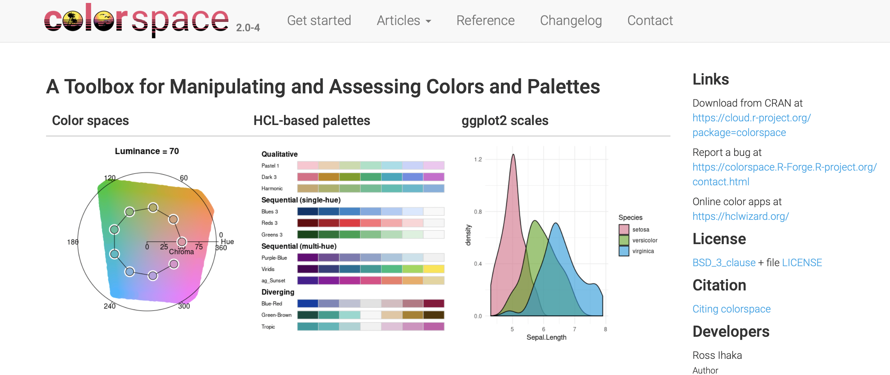

```{r note, include=FALSE}
## NB: By default the  template will create a new subdirectory with its files inside.
```


```{r packages, include=FALSE}
library(flipbookr)
library(here)
library(tidyverse)
library(kjhslides)
```


```{r setup, include=FALSE}
## Configure the slides

kjh_register_tenso()    # Default fonts. Comment out if you don't have Tenso and Berkeley fonts.
kjh_set_knitr_opts()    
kjh_set_slide_theme()   # ggplot theme to go with slides. Set tenso = FALSE if necessary.
kjh_set_xaringan_opts()

```


class: center middle main-title section-title-1

# .kjh-yellow[Polishing] & .kjh-lblue[Presenting] your Plots 

.class-info[

**Data Wrangling: Session 8**

.light[Kieran Healy<br>
Code Horizons, April 2022
]

]


---

layout: true
class: title title-1

---

# Load our libraries

```{r 03a-dplyr-basics-2, message = FALSE}
library(here)       # manage file paths
library(tidyverse)  # your friend and mine
library(socviz)     # data and some useful functions
library(ggrepel)    # Text and labels
library(colorspace) # luminance-balanced palettes
library(scales)      # scale adjustments and enhancements
library(ggforce)    # useful enhancements to ggplot
```


---

class: center middle main-title section-title-1

# .huge[.kjh-yellow[Piece by piece,]<br/>.kjh-lblue[Layer by layer]]

---

# Build your plots a piece at a time

```{r}
asasec <- as_tibble(asasec)
asasec
```

---

# Build your plots a piece at a time

```{r, echo = FALSE, fig.height=8, fig.width=12}
asasec |> 
  filter(Year == 2014) |> 
  ggplot(mapping = aes(x = Members, 
                       y = Revenues, 
                       label = Sname)) + 
  geom_smooth() + 
  geom_point()

```

---

# Build your plots a piece at a time

```{r, echo = FALSE, fig.height=8, fig.width=12}
asasec |> 
  filter(Year == 2014) |> 
  ggplot(mapping = aes(x = Members, 
                       y = Revenues, 
                       label = Sname)) + 
  geom_smooth(method = "lm", 
              se = FALSE, 
              color = "gray60") +
  geom_point(mapping = aes(color = Journal), 
             size = rel(3)) + 
  geom_text_repel(data=subset(asasec,
                    Year == 2014 & 
                    Revenues > 7000),
                    size = rel(5), 
                    mapping = 
                    aes(family = "Tenso Slide")) + 
  scale_y_continuous(labels = 
                       scales::label_dollar()) + 
  labs(x="Membership", y="Revenues",
        color = "Section has own Journal",
        title = "ASA Sections",
        subtitle = "2014 Calendar year.",
        caption = "Source: ASA annual report.") + 
  theme(legend.position = "bottom")
  

```


---
`r chunk_reveal("reveal-asasteps", widths = c(40,60), title = "# Build your plots a piece at a time")`

```{r reveal-asasteps, include = FALSE}
asasec |> 
  filter(Year == 2014) |> 
  ggplot(mapping = aes(x = Members, 
                       y = Revenues, 
                       label = Sname)) + 
  geom_smooth(method = "lm", 
              se = FALSE, 
              color = "gray60") +
  geom_point(mapping = aes(color = Journal), 
             size = rel(3)) + 
  geom_text_repel(data=subset(asasec,
                    Year == 2014 & 
                    Revenues > 7000),
                    size = rel(5), 
                    mapping = 
                    aes(family = "Tenso Slide")) + 
  scale_y_continuous(labels = 
                       scales::label_dollar()) + 
  labs(x="Membership", y="Revenues",
        color = "Section has own Journal",
        title = "ASA Sections",
        subtitle = "2014 Calendar year.",
        caption = "Source: ASA annual report.") + 
  theme(legend.position = "bottom")

```
---

class: center middle main-title section-title-1

# .huge[.kjh-lblue[More about Scales]]

```{r, echo = FALSE}
kjh_set_classic_theme()
```

---

# Working with .kjh-yellow[`color`] and .kjh-pink[`fill`] scales

- .center.large[.kjh-green[`scale\\\_`].kjh-orange[`<MAPPING>`].kjh-green[`\\\_`].kjh-lblue[`<KIND>`].kjh-green[`()`]]

- .large[Scale functions control the display of the variables they map. So to change the colors for `color` or `fill` mappings, you adjust the corresponding .kjh-green[`scale_`] function, not the .kjh-green[`theme()`] function.] 

- .large[.kjh-lblue[`ggplot`] has several color palettes built in. A variety of packages provide others.] 

---
`r chunk_reveal("reveal-scalemanual", widths = c(35,65), title = "# You can always specify scales manually")`

```{r reveal-scalemanual, include = FALSE}
p <- ggplot(data = organdata,
            mapping = aes(x = roads, 
                          y = donors, 
                          color = world)) + 
  geom_point(size = 4)

p

```

---
`r chunk_reveal("reveal-scalemanual2", widths = c(35,65), title = "# You can always specify scales manually")`

```{r reveal-scalemanual2, include = FALSE}
p + scale_color_manual(
  values = c("red", "green", "blue"))

```


---
`r chunk_reveal("reveal-scalemanual3", widths = c(35,65), title = "# You can always specify scales manually")`

```{r reveal-scalemanual3, include = FALSE}
p + scale_color_manual(
  values = c("#1B9E77","#D95F02", "#7570B3"))

```


---
`r chunk_reveal("reveal-scalemanual4", widths = c(35,65), title = "# You can always specify scales manually")`

```{r reveal-scalemanual4, include = FALSE}

colkey <- c("Corporatist" = "pink", 
            "Liberal" = "goldenrod", 
            "SocDem" = "firebrick")
colkey

p + scale_color_manual(
  values = colkey)

```

---

# But many balanced palettes are available

.pull-left[

### E.g., the `RColorBrewer` Palettes

- These are available through the .kjh-green[`scale_color-brewer()`] and .kjh-green[`scale_fill_brewer()`] functions, as well as independently.

- See the palettes with .kjh-green[`RColorBrewer::display.brewer.all()`]

]

--

.pull-right[

### The _qualitative_ palettes

```{r, echo = FALSE, fig.height=5.5, fig.width=7}
opar <- par(mar = c(5.1, 4.1, 4.1, 2.1))
par(mar=c(0,4,0,0))
RColorBrewer::display.brewer.all(type = "qual")
par(opar)
```


]

---

# But many balanced palettes are available

.pull-left[

### E.g., the `RColorBrewer` Palettes

- These are available through the .kjh-green[`scale_color-brewer()`] and .kjh-green[`scale_fill_brewer()`] functions, as well as independently.

- See the palettes with .kjh-green[`RColorBrewer::display.brewer.all()`]

]

--

.pull-right[

### The _sequential_ palettes

```{r, echo = FALSE, fig.height=5.5, fig.width=4}
par(mar=c(0,4,0,0))
RColorBrewer::display.brewer.all(type = "seq")
```


]

---

# But many balanced palettes are available

.pull-left[

### E.g., the `RColorBrewer` Palettes

- These are available through the .kjh-green[`scale_color-brewer()`] and .kjh-green[`scale_fill_brewer()`] functions, as well as independently.

- See the palettes with .kjh-green[`RColorBrewer::display.brewer.all()`]

]

--

.pull-right[

### The _diverging_ palettes

```{r, echo = FALSE, fig.height=5.5, fig.width=6}
par(mar=c(0,4,0,0))
RColorBrewer::display.brewer.all(type = "div")
```


]


---

# Categorical Brewer Palettes


```{r, eval = FALSE, fig.show="hold", out.width="50%"}
p + geom_point(size = 2) + 
  scale_color_brewer(palette = "Set2") +
  labs(title = "Set2")

p + geom_point(size = 2) + 
  scale_color_brewer(palette = "Pastel2") +
  labs(title = "Pastel2")

p + geom_point(size = 2) + 
  scale_color_brewer(palette = "Dark2") +
  labs(title = "Dark2")

p + geom_point(size = 2) + 
  scale_color_brewer(palette = "Accent") +
  labs(title = "Accent")
```

---
layout: false

.pull-left[
```{r, echo = FALSE, fig.height=4, fig.width=6}
p + geom_point(size = 3) + 
  scale_color_brewer(palette = "Set2") +
  labs(title = "Set2")
```

```{r, echo = FALSE, fig.height=4, fig.width=6}
p + geom_point(size = 3) + 
  scale_color_brewer(palette = "Pastel2") +
  labs(title = "Pastel2")
```
]

.pull-right[
```{r, echo = FALSE, fig.height=4, fig.width=6}
p + geom_point(size = 3) + 
  scale_color_brewer(palette = "Dark2") +
  labs(title = "Dark2")
```

```{r, echo = FALSE, fig.height=4, fig.width=6}
p + geom_point(size = 3) + 
  scale_color_brewer(palette = "Accent") +
  labs(title = "Accent")
```
]

.right.w90.small[Some color palettes]

---

layout: true
class: title title-1

---

# The .kjh-lblue[`colorspace`] package has even more

.center[]

---
layout: false

```{r, fig.height = 8, fig.width = 16, echo = FALSE}
colorspace::hcl_palettes(plot = TRUE)
```


.right.w90.small[So many colors]

---

layout: true
class: title title-1

---

# The .kjh-lblue[`colorspace`] function convention

- - .center.large[.kjh-green[`scale\\\_`].kjh-orange[`<MAPPING>`].kjh-green[`\\\_`].kjh-lblue[`<KIND>`].kjh-green[`\\\_`].kjh-pink[`<COLORSCALE>`].kjh-green[`()`]]

.pull-left.small[
.kjh-green[`scale_color_binned_diverging()`]

.kjh-green[`scale_color_binned_qualitative()`]

.kjh-green[`scale_color_binned_sequential()`]

.kjh-green[`scale_color_continuous_diverging()`]

.kjh-green[`scale_color_continuous_qualitative()`]

.kjh-green[`scale_color_continuous_sequential()`]

.kjh-green[`scale_color_discrete_diverging()`]

.kjh-green[`scale_color_discrete_qualitative()`]

.kjh-green[`scale_color_discrete_sequential()`]

]


.pull-right.small[

.kjh-green[`scale_fill_binned_diverging()`]

.kjh-green[`scale_fill_binned_divergingx()`]

.kjh-green[`scale_fill_binned_qualitative()`]

.kjh-green[`scale_fill_binned_sequential()`]

.kjh-green[`scale_fill_continuous_diverging()`]

.kjh-green[`scale_fill_continuous_qualitative()`]

.kjh-green[`scale_fill_continuous_sequential()`]

.kjh-green[`scale_fill_discrete_diverging()`]

.kjh-green[`scale_fill_discrete_qualitative()`]

.kjh-green[`scale_fill_discrete_sequential()`]

]

---

layout: true
class: title title-1

---

class: right bottom main-title section-title-1

## .huge.right.bottom.squish4[.kjh-yellow[Layer color and text<br />].kjh-lblue[to your advantage]]

---
layout: false

```{r, echo = FALSE}
kjh_set_slide_theme()
```


```{r, echo = FALSE, fig.width=15, fig.height=8.5}
# Democratic Blue and Republican Red
party_colors <- c("#2E74C0", "#CB454A")

ggplot(data = subset(county_data,
                     flipped == "No"),
       mapping = aes(x = pop,
                     y = black/100)) + 
  geom_point(alpha = 0.15, color = "gray30", 
             size = rel(2)) +
  scale_x_log10(labels = label_comma()) + 
  geom_point(data = subset(county_data,
                      flipped == "Yes"),
             mapping = aes(x = pop, y = black/100,
                           color = partywinner16), 
             size = rel(2)) +
  geom_text_repel(data = subset(county_data,
                                flipped == "Yes" &
                                  black  > 25),
                  mapping = aes(x = pop,
                                y = black/100,
                                label = state, 
                                family = "Tenso Slide", 
                                face = "bold"), 
                  size = 3.5) + 
  scale_color_manual(values = party_colors) + 
  scale_y_continuous(labels = label_percent()) +
  labs(color = "County flipped to ... ",
       x = "County Population (log scale)",
       y = "Percent Black Population",
       title = "Flipped counties, 2016",
       caption = "Counties in gray did not flip.")


```

---

layout: true
class: title title-1

---
`r chunk_reveal("reveal-fliptrump", widths = c(45,55), title = "# We know how to build this")`

```{r reveal-fliptrump, include = FALSE}
# Democratic Blue and Republican Red
party_colors <- c("#2E74C0", "#CB454A")

ggplot(data = subset(county_data,
                     flipped == "No"),
       mapping = aes(x = pop,
                     y = black/100)) + 
  geom_point(alpha = 0.15, color = "gray30", 
             size = rel(2)) +
  scale_x_log10(labels = label_comma()) + 
  geom_point(data = subset(county_data,
                      flipped == "Yes"),
             mapping = aes(x = pop, y = black/100,
                           color = partywinner16), 
             size = rel(2)) +
  geom_text_repel(data = subset(county_data,
              flipped == "Yes" & black  > 25),
                  mapping = aes(x = pop,
                    y = black/100, label = state, 
                    family = "Tenso Slide", 
                    face = "bold"), size = rel(3.5)) + 
  scale_color_manual(values = party_colors) + 
  scale_y_continuous(labels = label_percent()) +
  labs(color = "County flipped to ... ",
       x = "County Population (log scale)",
       y = "Percent Black Population",
       title = "Flipped counties, 2016",
       caption = "Counties in gray did not flip.")
 
```

---

layout: true
class: title title-1

---

# In practice

- Imagine making several versions of this plot to accompany a presentation. 


---
layout: false


```{r, echo = FALSE}
county_data <- as_tibble(county_data) |> 
  filter(!is.na(name) & name %nin% as.character(c(1:52)))

pop_min <- min(county_data$pop)
pop_max <- max(county_data$pop)

black_min <- min(county_data$black/100)
black_max <- max(county_data$black/100 + 0.047)


x_breaks <- c(1e3, 1e4, 1e5, 1e6, 1e7)
y_breaks <- seq(from = 0, to = 0.8, by = 0.2)

p_layer_1 <- ggplot(data = county_data,
                    mapping = aes(x = pop, y = black/100)) + 
  geom_point(color = "gray30", 
             alpha = 0.25, 
             size = rel(2)) + 
  scale_x_log10(breaks = x_breaks,
                labels = label_number(scale_cut = cut_short_scale())) + 
  scale_y_continuous(breaks = y_breaks, 
                     labels = label_percent()) +
  expand_limits(x = pop_max, 
                y = black_max) +
  labs(x = "County Population (log scale)",
       y = "Percent Black Population",
       title = "U.S. Counties by Population and Percent Black",
       caption = "")

p_layer_2 <- ggplot(data = subset(county_data,
                     flipped == "No"),
                    mapping = aes(x = pop, y = black/100)) + 
  geom_point(color = "gray30", 
             alpha = 0.25, 
             size = rel(2)) + 
  expand_limits(x = pop_max, 
                y = black_max) +
  scale_x_log10(breaks = x_breaks,
                labels = label_number(scale_cut = cut_short_scale())) + 
  scale_y_continuous(breaks = y_breaks, 
                     labels = label_percent()) +
  labs(x = "County Population (log scale)",
       y = "Percent Black Population",
       title = "These Counties Did not Flip in 2016",
       caption = "")


p_layer_3 <- ggplot(data = subset(county_data,
                     flipped == "Yes"),
                    mapping = aes(x = pop, y = black/100)) + 
  geom_point(color = "gray30", 
             alpha = 0.25, 
             size = rel(2)) + 
   geom_point(data = subset(county_data,
                     flipped == "Yes"), 
              color = NA, 
              alpha = 0,
              size = rel(2)) +
  scale_x_log10(breaks = x_breaks,
                labels = label_number(scale_cut = cut_short_scale())) + 
  scale_y_continuous(breaks = y_breaks, 
                     labels = label_percent()) +
  expand_limits(x = pop_max, 
                y = black_max) +
  labs(x = "County Population (log scale)",
       y = "Percent Black Population",
       title = "These Counties Did",
       caption = "")


p_layer_4 <- ggplot(data = subset(county_data,
                     flipped == "No"),
                    mapping = aes(x = pop, y = black/100)) + 
  geom_point(color = "gray30", 
             alpha = 0.25, 
             size = rel(2)) + 
  geom_point(data = subset(county_data,
                      flipped == "Yes"),
             mapping = aes(x = pop, y = black/100,
                           color = partywinner16), 
             size = rel(2)) + 
  scale_x_log10(breaks = x_breaks,
                labels = label_number(scale_cut = cut_short_scale())) + 
  scale_y_continuous(breaks = y_breaks, 
                     labels = label_percent()) +
  scale_color_manual(values = party_colors) +
  expand_limits(x = pop_max, 
                y = black_max) +
  labs(x = "County Population (log scale)",
       y = "Percent Black Population",
       title = "Counties that Flipped shown by Party Color",
       color = "Flipped to",
       caption = "Counties in gray did not flip.")

p_layer_5 <- ggplot(data = subset(county_data,
                     flipped == "No"),
                    mapping = aes(x = pop, y = black/100)) + 
  geom_point(color = "gray30", 
             alpha = 0.25, 
             size = rel(2)) + 
  geom_point(data = subset(county_data,
                      flipped == "Yes"),
             mapping = aes(x = pop, y = black/100,
                           color = partywinner16), 
             size = rel(2)) + 
  geom_text_repel(data = subset(county_data,
              flipped == "Yes" & black  > 25),
                  mapping = aes(x = pop,
                    y = black/100, label = state, 
                    family = "Tenso Slide", 
                    face = "bold"), size = rel(3.5)) + 
  scale_x_log10(breaks = x_breaks,
                labels = label_number(scale_cut = cut_short_scale())) + 
  scale_y_continuous(breaks = y_breaks, 
                     labels = label_percent()) +
  scale_color_manual(values = party_colors) +
  expand_limits(x = pop_max, 
                y = black_max) +
  labs(x = "County Population (log scale)",
       y = "Percent Black Population",
       color = "Flipped to",
       title = "Counties that Flipped shown by Party Color, and labeled by State",
       caption = "Counties in gray did not flip.")


## Zoom in -- replace expand_limits() with coord_cartesian()
## Adjust repel criteria also
p_layer_6 <- ggplot(data = subset(county_data,
                     flipped == "No"),
                    mapping = aes(x = pop, y = black/100)) + 
  geom_point(color = "gray30", 
             alpha = 0.25, 
             size = rel(2)) + 
  geom_point(data = subset(county_data,
                      flipped == "Yes"),
             mapping = aes(x = pop, y = black/100,
                           color = partywinner16), 
             size = rel(2)) + 
  geom_text_repel(data = subset(county_data,
              flipped == "Yes" & black  
              > 35 & black < 50),
                  mapping = aes(x = pop,
                    y = black/100, label = state, 
                    family = "Tenso Slide", 
                    face = "bold"), size = rel(3.5)) + 
  scale_x_log10(breaks = x_breaks,
                labels = label_number(scale_cut = cut_short_scale())) + 
  scale_y_continuous(breaks = y_breaks, 
                     labels = label_percent()) +
  scale_color_manual(values = party_colors) +
  coord_cartesian(xlim = c(0.75e4, 1.5e5), 
                  ylim = c(0.2, 0.5)) +
  labs(x = "County Population (log scale)",
       y = "Percent Black Population",
       color = "Flipped to",
       title = "Counties that Flipped shown by Party Color, and labeled by State",
       caption = "Counties in gray did not flip.")


```

```{r, echo = FALSE, fig.width=15, fig.height=8.5}
p_layer_1
```

---
layout: false

```{r, echo = FALSE, fig.width=15, fig.height=8.5}
p_layer_2
```

---
layout: false

```{r, echo = FALSE, fig.width=15, fig.height=8.5}
p_layer_3
```

---
layout: false

```{r, echo = FALSE, fig.width=15, fig.height=8.5}
p_layer_4
```

---
layout: false

```{r, echo = FALSE, fig.width=15, fig.height=8.5}
p_layer_5
```

---
layout: false

```{r, echo = FALSE, fig.width=15, fig.height=8.5}
p_layer_6
```


---
layout: false

```{r, echo = FALSE, fig.width=15, fig.height=8.5}
p_layer_5
```


